# M2 物业管理服务模块 · 业务流程图与架构图集

> **模块名称：** M2 物业管理服务（Property Service）
> **适用范围：** `app/workorder-service`、`app/visitor-service`、`app/parking-service`、`app/notice-service`
> **对齐依据：** `docs/M2物业管理服务模块设计文档.md`（V1.1）、`docs/M2网关路由与端口清单.md`、各服务 `.api` 契约、`internal/state/fsm.go`、`common/kafka/topics.go`
> **更新时间：** 2026-09-15
> **渲染说明：** 本文所有图均为 Mermaid 语法，可在 IDE / GitHub / VS Code（Markdown Preview Mermaid Support）中直接渲染。

> ⚠️ **状态机口径说明**：本图集以**代码实际实现**为准 —— 工单 FSM 为 5 态 `待派单(0) → 处理中(1) → 待验收(2) → 已完成(3) → 已关闭(4)`；设计文档正文中残留的"待受理 / 已驳回 / 已取消"为已合并的旧口径（建单即待派单、驳回回到处理中、取消即 close）。

---

## 一、功能架构图

### 1.1 M2 功能架构（服务 → 功能 → 接口）

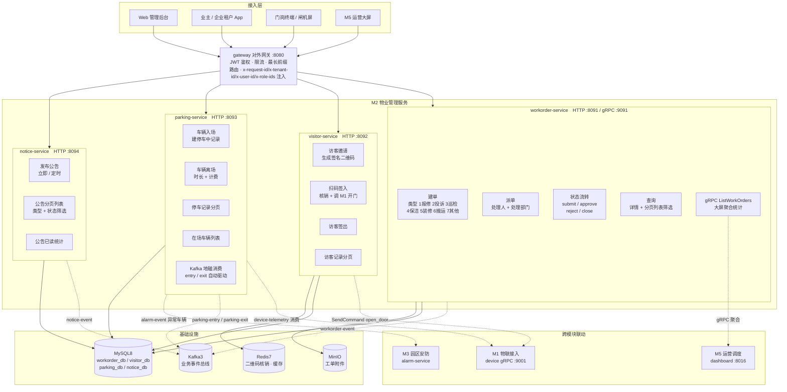
```mermaid
flowchart TB
    subgraph Access["接入层"]
        Web["Web 管理后台"]
        App["业主 / 企业租户 App"]
        Gate["门岗终端 / 闸机屏"]
        Screen["M5 运营大屏"]
    end

    GW["gateway 对外网关 :8080<br/>JWT 鉴权 · 限流 · 最长前缀路由 · x-request-id/x-tenant-id/x-user-id/x-role-ids 注入"]

    subgraph M2["M2 物业管理服务"]
        direction TB

        subgraph S1["workorder-service　HTTP :8091 / gRPC :9091"]
            direction LR
            F1a["建单<br/>类型 1报修 2投诉 3巡检<br/>4保洁 5装修 6搬运 7其他"]
            F1b["派单<br/>处理人 + 处理部门"]
            F1c["状态流转<br/>submit / approve<br/>reject / close"]
            F1d["查询<br/>详情 + 分页列表筛选"]
            F1e["gRPC ListWorkOrders<br/>大屏聚合统计"]
        end

        subgraph S2["visitor-service　HTTP :8092"]
            direction LR
            F2a["访客邀请<br/>生成签名二维码"]
            F2b["扫码签入<br/>核销 + 调 M1 开门"]
            F2c["访客签出"]
            F2d["访客记录分页"]
        end

        subgraph S3["parking-service　HTTP :8093"]
            direction LR
            F3a["车辆入场<br/>建停车中记录"]
            F3b["车辆离场<br/>时长 + 计费"]
            F3c["停车记录分页"]
            F3d["在场车辆列表"]
            F3e["Kafka 地磁消费<br/>entry / exit 自动驱动"]
        end

        subgraph S4["notice-service　HTTP :8094"]
            direction LR
            F4a["发布公告<br/>立即 / 定时"]
            F4b["公告分页列表<br/>类型 + 状态筛选"]
            F4c["公告已读统计"]
        end
    end

    subgraph Cross["跨模块联动"]
        M1["M1 物联接入<br/>device gRPC :9001"]
        M3["M3 园区安防<br/>alarm-service"]
        M5["M5 运营调度<br/>dashboard :8016"]
    end

    subgraph Infra["基础设施"]
        MySQL[("MySQL8<br/>workorder_db / visitor_db<br/>parking_db / notice_db")]
        Redis[("Redis7<br/>二维码核销 · 缓存")]
        Kafka[("Kafka3<br/>业务事件总线")]
        MinIO[("MinIO<br/>工单附件")]
    end

    Web --> GW
    App --> GW
    Gate --> GW
    Screen --> GW

    GW --> S1
    GW --> S2
    GW --> S3
    GW --> S4

    F1e -. "gRPC 聚合" .-> M5
    S1 -. "workorder-event" .-> Kafka
    S2 -. "SendCommand open_door" .-> M1
    S3 -. "device-telemetry 消费" .-> M1
    S3 -. "parking-entry / parking-exit" .-> Kafka
    S3 -. "alarm-event 异常车辆" .-> M3
    S4 -. "notice-event" .-> Kafka

    S1 --> MySQL
    S2 --> MySQL
    S3 --> MySQL
    S4 --> MySQL
    S2 --> Redis
    S1 --> MinIO
```

### 1.2 M2 服务全景与端口拓扑

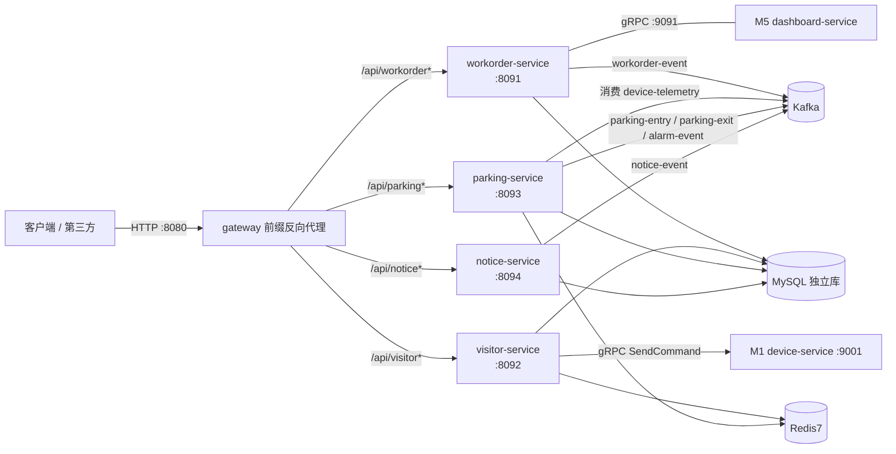
```mermaid
flowchart LR
    C["客户端 / 第三方"] -->|"HTTP :8080"| GW["gateway 前缀反向代理"]

    GW -->|"/api/workorder*"| WO["workorder-service<br/>:8091"]
    GW -->|"/api/visitor*"| VI["visitor-service<br/>:8092"]
    GW -->|"/api/parking*"| PA["parking-service<br/>:8093"]
    GW -->|"/api/notice*"| NO["notice-service<br/>:8094"]

    WO ---|"gRPC :9091"| M5["M5 dashboard-service"]
    WO -->|"workorder-event"| KQ[("Kafka")]
    VI -->|"gRPC SendCommand"| M1["M1 device-service :9001"]
    PA -->|"消费 device-telemetry"| KQ
    PA -->|"parking-entry / parking-exit / alarm-event"| KQ
    NO -->|"notice-event"| KQ

    WO & VI & PA & NO --> DB[("MySQL 独立库")]
    VI & PA --> RD[("Redis7")]
```

---

## 二、业务流程图

### 2.1 工单全生命周期流程（泳道）

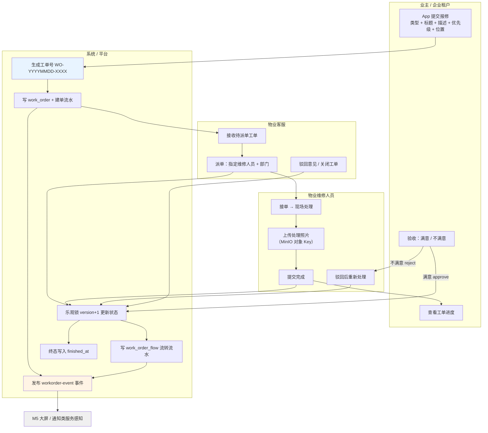
```mermaid
flowchart TB
    subgraph U["业主 / 企业租户"]
        U1["App 提交报修<br/>类型 + 标题 + 描述 + 优先级 + 位置"]
        U2["查看工单进度"]
        U3["验收：满意 / 不满意"]
    end

    subgraph CS["物业客服"]
        C1["接收待派单工单"]
        C2["派单：指定维修人员 + 部门"]
        C3["驳回意见 / 关闭工单"]
    end

    subgraph MT["物业维修人员"]
        M1["接单 → 现场处理"]
        M2["上传处理照片<br/>（MinIO 对象 Key）"]
        M3["提交完成"]
        M4["驳回后重新处理"]
    end

    subgraph SYS["系统 / 平台"]
        Y1["生成工单号 WO-YYYYMMDD-XXXX"]
        Y2["写 work_order + 建单流水"]
        Y3["乐观锁 version+1 更新状态"]
        Y4["写 work_order_flow 流转流水"]
        Y5["发布 workorder-event 事件"]
        Y6["终态写入 finished_at"]
    end

    U1 --> Y1 --> Y2 --> C1
    Y2 --> Y5
    C1 --> C2
    C2 --> Y3 --> Y4 --> Y5
    C2 --> M1
    M1 --> M2 --> M3
    M3 --> Y3
    M3 --> U2
    U3 -->|"满意 approve"| Y3
    U3 -->|"不满意 reject"| M4
    M4 --> Y3
    Y3 --> Y6
    C3 --> Y3
    Y5 --> EXT["M5 大屏 / 通知类服务感知"]

    style Y1 fill:#e8f4ff
    style Y5 fill:#fff4e5
    style EXT fill:#f0f0f0
```

### 2.2 访客通行流程

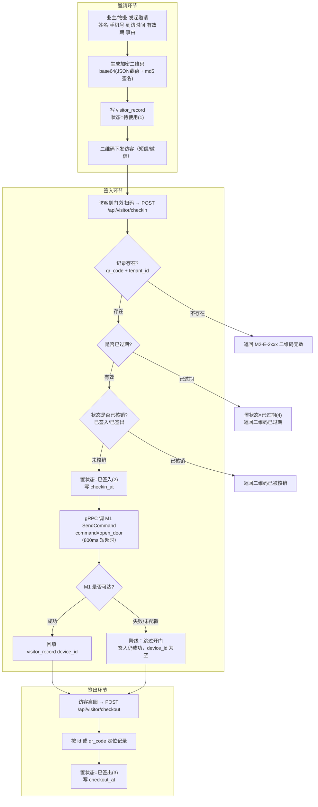
```mermaid
flowchart TB
    subgraph IN["邀请环节"]
        A1["业主/物业 发起邀请<br/>姓名·手机号·到访时间·有效期·事由"]
        A2["生成加密二维码<br/>base64(JSON载荷 + md5 签名)"]
        A3["写 visitor_record<br/>状态=待使用(1)"]
        A4["二维码下发访客（短信/微信）"]
    end

    subgraph CK["签入环节"]
        B1["访客到门岗 扫码 → POST /api/visitor/checkin"]
        B2{"记录存在?<br/>qr_code + tenant_id"}
        B3{"是否已过期?"}
        B4{"状态是否已核销?<br/>已签入/已签出"}
        B5["置状态=已签入(2)<br/>写 checkin_at"]
        B6["gRPC 调 M1 SendCommand<br/>command=open_door（800ms 短超时）"]
        B7{"M1 是否可达?"}
        B8["回填 visitor_record.device_id"]
        B9["降级：跳过开门<br/>签入仍成功，device_id 为空"]
    end

    subgraph OUT["签出环节"]
        C1["访客离园 → POST /api/visitor/checkout"]
        C2["按 id 或 qr_code 定位记录"]
        C3["置状态=已签出(3)<br/>写 checkout_at"]
    end

    A1 --> A2 --> A3 --> A4 --> B1
    B1 --> B2
    B2 -->|"不存在"| E1["返回 M2-E-2xxx 二维码无效"]
    B2 -->|"存在"| B3
    B3 -->|"已过期"| E2["置状态=已过期(4)<br/>返回二维码已过期"]
    B3 -->|"有效"| B4
    B4 -->|"已核销"| E3["返回二维码已被核销"]
    B4 -->|"未核销"| B5
    B5 --> B6 --> B7
    B7 -->|"成功"| B8 --> C1
    B7 -->|"失败/未配置"| B9 --> C1
    C1 --> C2 --> C3
```

### 2.3 停车自动计费流程（Kafka 事件驱动 + HTTP 联调双通道）

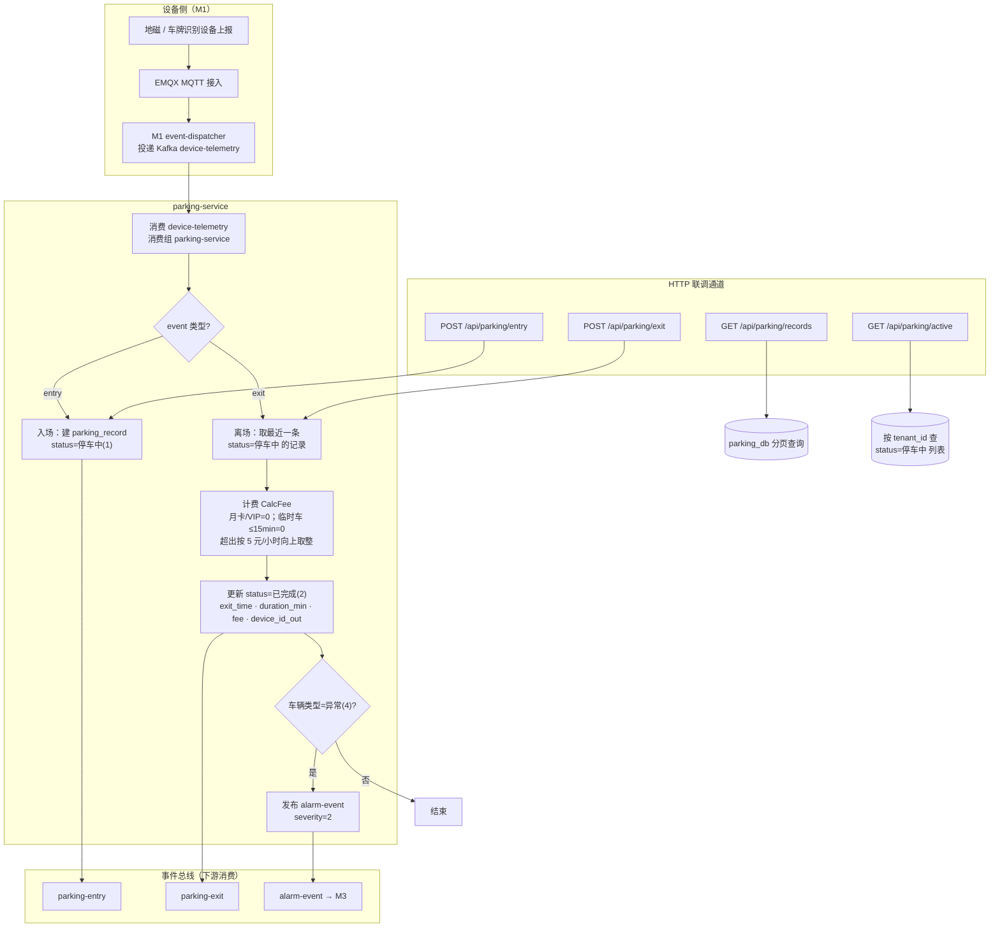
```mermaid
flowchart TB
    subgraph DEV["设备侧（M1）"]
        D1["地磁 / 车牌识别设备上报"]
        D2["EMQX MQTT 接入"]
        D3["M1 event-dispatcher<br/>投递 Kafka device-telemetry"]
    end

    subgraph PARK["parking-service"]
        P1["消费 device-telemetry<br/>消费组 parking-service"]
        P2{"event 类型?"}
        P3["入场：建 parking_record<br/>status=停车中(1)"]
        P4["离场：取最近一条<br/>status=停车中 的记录"]
        P5["计费 CalcFee<br/>月卡/VIP=0；临时车 ≤15min=0<br/>超出按 5 元/小时向上取整"]
        P6["更新 status=已完成(2)<br/>exit_time · duration_min · fee · device_id_out"]
        P7{"车辆类型=异常(4)?"}
        P8["发布 alarm-event<br/>severity=2"]
    end

    subgraph HTTP["HTTP 联调通道"]
        H1["POST /api/parking/entry"]
        H2["POST /api/parking/exit"]
        H3["GET /api/parking/records"]
        H4["GET /api/parking/active"]
    end

    subgraph BUS["事件总线（下游消费）"]
        K1["parking-entry"]
        K2["parking-exit"]
        K3["alarm-event → M3"]
    end

    D1 --> D2 --> D3 --> P1 --> P2
    P2 -->|"entry"| P3 --> K1
    P2 -->|"exit"| P4 --> P5 --> P6 --> K2
    P6 --> P7
    P7 -->|"是"| P8 --> K3
    P7 -->|"否"| FIN["结束"]

    H1 --> P3
    H2 --> P4
    H3 --> Q1[("parking_db 分页查询")]
    H4 --> Q2[("按 tenant_id 查<br/>status=停车中 列表")]
```

### 2.4 公告发布与推送流程

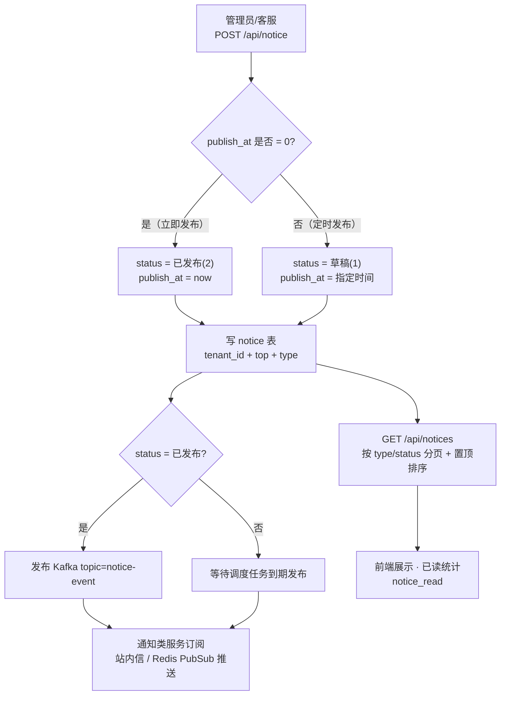
```mermaid
flowchart TB
    S1["管理员/客服<br/>POST /api/notice"] --> S2{"publish_at 是否 = 0?"}
    S2 -->|"是（立即发布）"| S3["status = 已发布(2)<br/>publish_at = now"]
    S2 -->|"否（定时发布）"| S4["status = 草稿(1)<br/>publish_at = 指定时间"]
    S3 --> S5["写 notice 表<br/>tenant_id + top + type"]
    S4 --> S5
    S5 --> S6{"status = 已发布?"}
    S6 -->|"是"| S7["发布 Kafka topic=notice-event"]
    S6 -->|"否"| S8["等待调度任务到期发布"]
    S7 --> S9["通知类服务订阅<br/>站内信 / Redis PubSub 推送"]
    S8 --> S9
    S5 --> L1["GET /api/notices<br/>按 type/status 分页 + 置顶排序"]
    L1 --> L2["前端展示 · 已读统计<br/>notice_read"]
```

### 2.5 异常自动派单（跨模块联动）

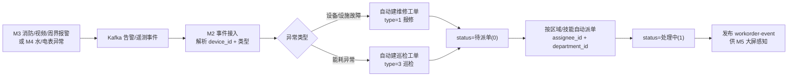
```mermaid
flowchart LR
    A1["M3 消防/视频/周界报警<br/>或 M4 水/电表异常"] --> A2["Kafka 告警/遥测事件"]
    A2 --> A3["M2 事件接入<br/>解析 device_id + 类型"]
    A3 --> A4{"异常类型"}
    A4 -->|"设备/设施故障"| A5["自动建维修工单<br/>type=1 报修"]
    A4 -->|"能耗异常"| A6["自动建巡检工单<br/>type=3 巡检"]
    A5 --> A7["status=待派单(0)"]
    A6 --> A7
    A7 --> A8["按区域/技能自动派单<br/>assignee_id + department_id"]
    A8 --> A9["status=处理中(1)"]
    A9 --> A10["发布 workorder-event<br/>供 M5 大屏感知"]
```

---

## 三、流转图（状态机）

### 3.1 工单状态机（5 态，`internal/state/fsm.go` 实现口径）

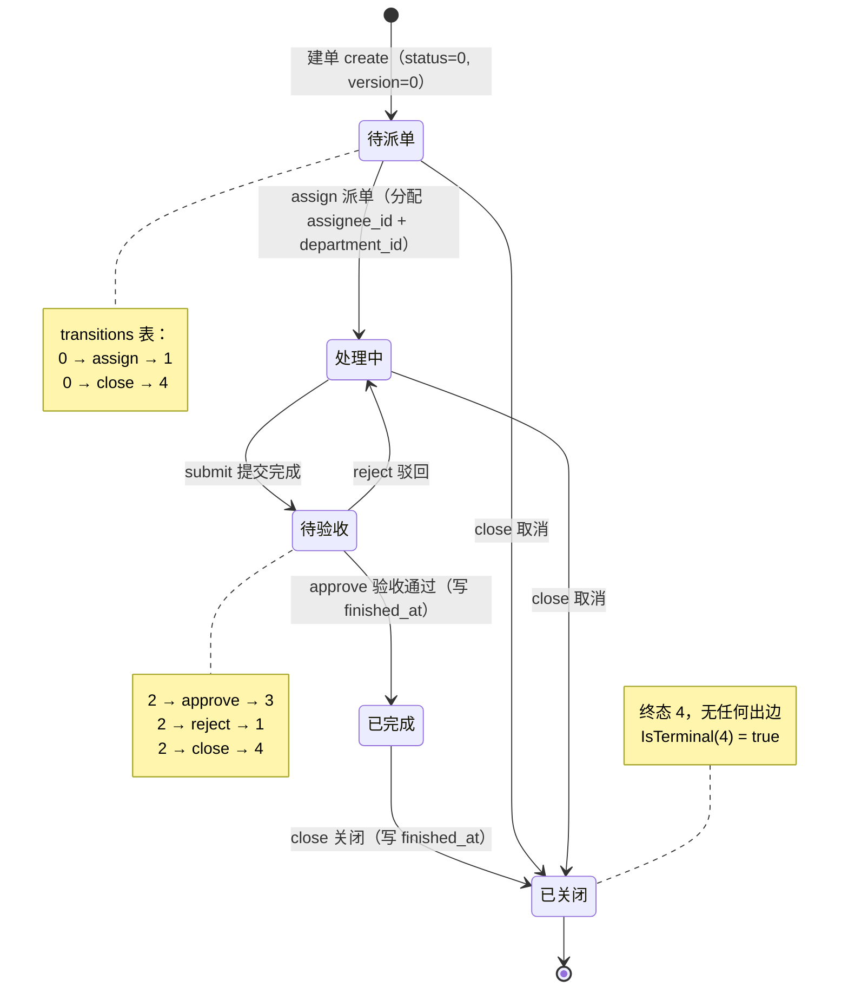
```mermaid
stateDiagram-v2
    [*] --> 待派单 : 建单 create（status=0, version=0）
    待派单 --> 处理中 : assign 派单（分配 assignee_id + department_id）
    处理中 --> 待验收 : submit 提交完成
    待验收 --> 已完成 : approve 验收通过（写 finished_at）
    待验收 --> 处理中 : reject 驳回
    已完成 --> 已关闭 : close 关闭（写 finished_at）
    待派单 --> 已关闭 : close 取消
    处理中 --> 已关闭 : close 取消
    已关闭 --> [*]

    note right of 待派单
        transitions 表：
        0 → assign → 1
        0 → close  → 4
    end note
    note right of 待验收
        2 → approve → 3
        2 → reject  → 1
        2 → close   → 4
    end note
    note left of 已关闭
        终态 4，无任何出边
        IsTerminal(4) = true
    end note
```

**FSM 转移表（与代码逐条对应）**

| from 状态 | action | to 状态 | 说明 |
| --- | --- | --- | --- |
| 待派单(0) | `assign` | 处理中(1) | 派单，同时写 `assignee_id`/`department_id` |
| 待派单(0) | `close` | 已关闭(4) | 取消工单 |
| 处理中(1) | `submit` | 待验收(2) | 维修提交完成 |
| 处理中(1) | `close` | 已关闭(4) | 取消工单 |
| 待验收(2) | `approve` | 已完成(3) | 验收通过，写 `finished_at` |
| 待验收(2) | `reject` | 处理中(1) | 驳回，回到处理中 |
| 待验收(2) | `close` | 已关闭(4) | 取消工单 |
| 已完成(3) | `close` | 已关闭(4) | 归档关闭 |

> 并发控制：所有流转均带 `WHERE id=? AND tenant_id=? AND version=?`，`RowsAffected==0` 即视为并发冲突，返回"请刷新后重试"。

### 3.2 访客记录状态机（4 态）

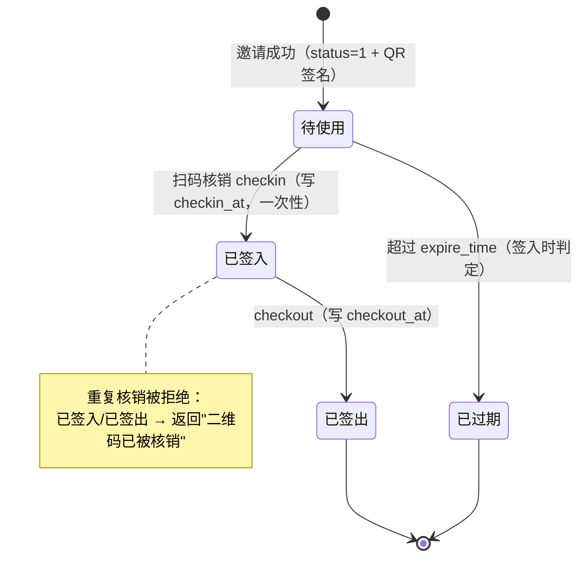
```mermaid
stateDiagram-v2
    [*] --> 待使用 : 邀请成功（status=1 + QR 签名）
    待使用 --> 已签入 : 扫码核销 checkin（写 checkin_at，一次性）
    已签入 --> 已签出 : checkout（写 checkout_at）
    待使用 --> 已过期 : 超过 expire_time（签入时判定）
    已签出 --> [*]
    已过期 --> [*]

    note right of 已签入
        重复核销被拒绝：
        已签入/已签出 → 返回"二维码已被核销"
    end note
```

### 3.3 停车记录状态机（2 态）

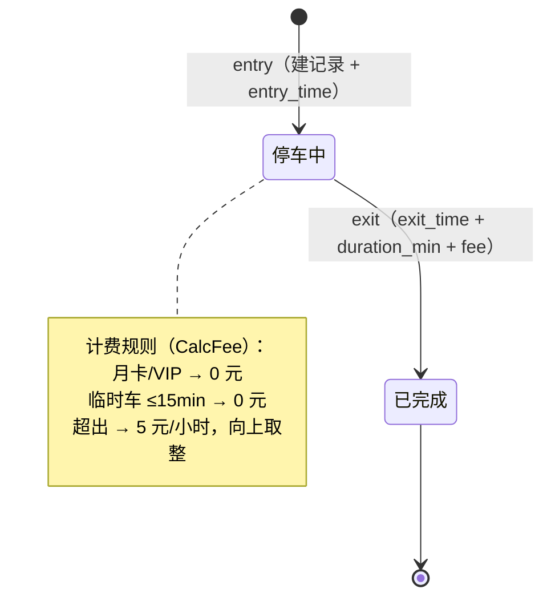
```mermaid
stateDiagram-v2
    [*] --> 停车中 : entry（建记录 + entry_time）
    停车中 --> 已完成 : exit（exit_time + duration_min + fee）
    已完成 --> [*]

    note right of 停车中
        计费规则（CalcFee）：
        月卡/VIP → 0 元
        临时车 ≤15min → 0 元
        超出 → 5 元/小时，向上取整
    end note
```

### 3.4 公告状态机（3 态）

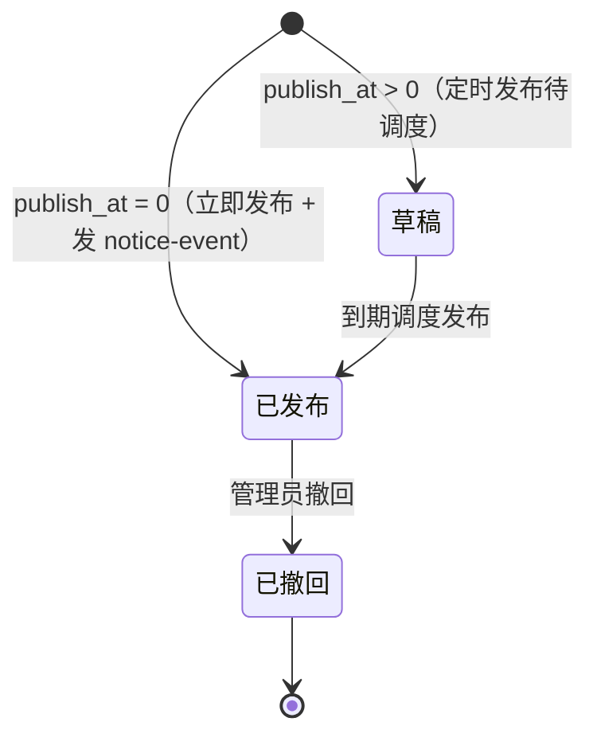
```mermaid
stateDiagram-v2
    [*] --> 草稿 : publish_at > 0（定时发布待调度）
    [*] --> 已发布 : publish_at = 0（立即发布 + 发 notice-event）
    草稿 --> 已发布 : 到期调度发布
    已发布 --> 已撤回 : 管理员撤回
    已撤回 --> [*]
```

---

## 四、时序图

### 4.1 工单主流程：建单 → 派单 → 提交 → 验收（含乐观锁与事件）

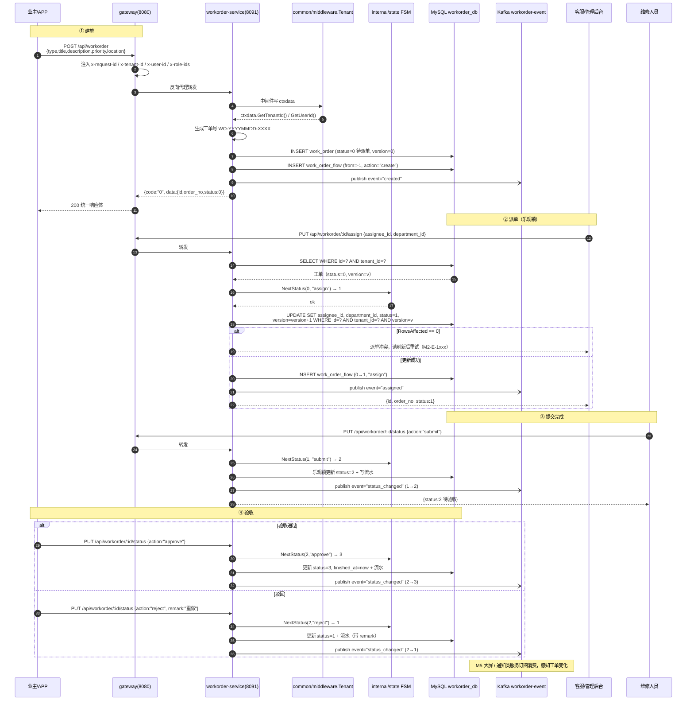
```mermaid
sequenceDiagram
    autonumber
    participant U as 业主/APP
    participant GW as gateway(8080)
    participant WO as workorder-service(8091)
    participant MW as common/middleware.Tenant
    participant FSM as internal/state FSM
    participant DB as MySQL workorder_db
    participant KQ as Kafka workorder-event
    participant CS as 客服/管理后台
    participant MT as 维修人员

    Note over U,GW: ① 建单
    U->>GW: POST /api/workorder<br/>{type,title,description,priority,location}
    GW->>GW: 注入 x-request-id / x-tenant-id / x-user-id / x-role-ids
    GW->>WO: 反向代理转发
    WO->>MW: 中间件写 ctxdata
    MW-->>WO: ctxdata.GetTenantId() / GetUserId()
    WO->>WO: 生成工单号 WO-YYYYMMDD-XXXX
    WO->>DB: INSERT work_order (status=0 待派单, version=0)
    WO->>DB: INSERT work_order_flow (from=-1, action="create")
    WO-)KQ: publish event="created"
    WO-->>GW: {code:"0", data:{id,order_no,status:0}}
    GW-->>U: 200 统一响应体

    Note over CS,DB: ② 派单（乐观锁）
    CS->>GW: PUT /api/workorder/:id/assign {assignee_id, department_id}
    GW->>WO: 转发
    WO->>DB: SELECT WHERE id=? AND tenant_id=?
    DB-->>WO: 工单（status=0, version=v）
    WO->>FSM: NextStatus(0, "assign") → 1
    FSM-->>WO: ok
    WO->>DB: UPDATE SET assignee_id, department_id, status=1,<br/>version=version+1 WHERE id=? AND tenant_id=? AND version=v
    alt RowsAffected == 0
        WO-->>CS: 派单冲突，请刷新后重试（M2-E-1xxx）
    else 更新成功
        WO->>DB: INSERT work_order_flow (0→1, "assign")
        WO-)KQ: publish event="assigned"
        WO-->>CS: {id, order_no, status:1}
    end

    Note over MT,DB: ③ 提交完成
    MT->>GW: PUT /api/workorder/:id/status {action:"submit"}
    GW->>WO: 转发
    WO->>FSM: NextStatus(1, "submit") → 2
    WO->>DB: 乐观锁更新 status=2 + 写流水
    WO-)KQ: publish event="status_changed" (1→2)
    WO-->>MT: {status:2 待验收}

    Note over U,DB: ④ 验收
    alt 验收通过
        U->>WO: PUT /api/workorder/:id/status {action:"approve"}
        WO->>FSM: NextStatus(2,"approve") → 3
        WO->>DB: 更新 status=3, finished_at=now + 流水
        WO-)KQ: publish event="status_changed" (2→3)
    else 驳回
        U->>WO: PUT /api/workorder/:id/status {action:"reject", remark:"重做"}
        WO->>FSM: NextStatus(2,"reject") → 1
        WO->>DB: 更新 status=1 + 流水（带 remark）
        WO-)KQ: publish event="status_changed" (2→1)
    end

    Note over KQ: M5 大屏 / 通知类服务订阅消费，感知工单变化
```

### 4.2 访客邀请 + 扫码签入（含 M1 开门与降级）

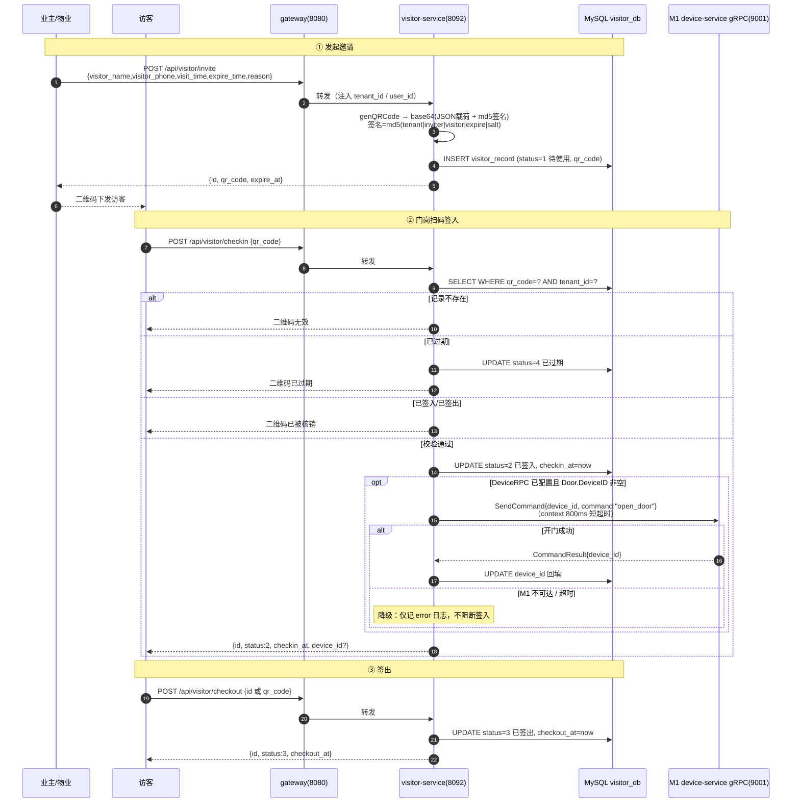
```mermaid
sequenceDiagram
    autonumber
    participant O as 业主/物业
    participant V as 访客
    participant GW as gateway(8080)
    participant VI as visitor-service(8092)
    participant DB as MySQL visitor_db
    participant M1 as M1 device-service gRPC(9001)

    Note over O,DB: ① 发起邀请
    O->>GW: POST /api/visitor/invite<br/>{visitor_name,visitor_phone,visit_time,expire_time,reason}
    GW->>VI: 转发（注入 tenant_id / user_id）
    VI->>VI: genQRCode → base64(JSON载荷 + md5签名)<br/>签名=md5(tenant|inviter|visitor|expire|salt)
    VI->>DB: INSERT visitor_record (status=1 待使用, qr_code)
    VI-->>O: {id, qr_code, expire_at}
    O-->>V: 二维码下发访客

    Note over V,M1: ② 门岗扫码签入
    V->>GW: POST /api/visitor/checkin {qr_code}
    GW->>VI: 转发
    VI->>DB: SELECT WHERE qr_code=? AND tenant_id=?
    alt 记录不存在
        VI-->>V: 二维码无效
    else 已过期
        VI->>DB: UPDATE status=4 已过期
        VI-->>V: 二维码已过期
    else 已签入/已签出
        VI-->>V: 二维码已被核销
    else 校验通过
        VI->>DB: UPDATE status=2 已签入, checkin_at=now
        opt DeviceRPC 已配置且 Door.DeviceID 非空
            VI->>M1: SendCommand{device_id, command:"open_door"}<br/>（context 800ms 短超时）
            alt 开门成功
                M1-->>VI: CommandResult{device_id}
                VI->>DB: UPDATE device_id 回填
            else M1 不可达 / 超时
                Note over VI: 降级：仅记 error 日志，不阻断签入
            end
        end
        VI-->>V: {id, status:2, checkin_at, device_id?}
    end

    Note over V,DB: ③ 签出
    V->>GW: POST /api/visitor/checkout {id 或 qr_code}
    GW->>VI: 转发
    VI->>DB: UPDATE status=3 已签出, checkout_at=now
    VI-->>V: {id, status:3, checkout_at}
```

### 4.3 停车入场（Kafka 地磁事件驱动）

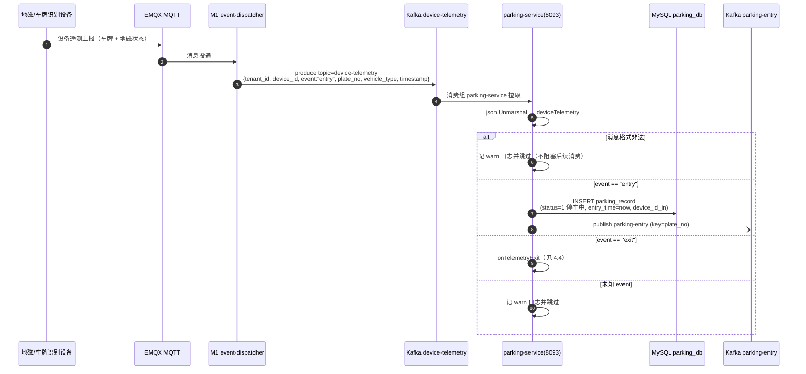
```mermaid
sequenceDiagram
    autonumber
    participant DEV as 地磁/车牌识别设备
    participant EMQX as EMQX MQTT
    participant M1 as M1 event-dispatcher
    participant KQ as Kafka device-telemetry
    participant PA as parking-service(8093)
    participant DB as MySQL parking_db
    participant OUT as Kafka parking-entry

    DEV->>EMQX: 设备遥测上报（车牌 + 地磁状态）
    EMQX->>M1: 消息投递
    M1->>KQ: produce topic=device-telemetry<br/>{tenant_id, device_id, event:"entry", plate_no, vehicle_type, timestamp}
    KQ->>PA: 消费组 parking-service 拉取
    PA->>PA: json.Unmarshal → deviceTelemetry
    alt 消息格式非法
        PA->>PA: 记 warn 日志并跳过（不阻塞后续消费）
    else event == "entry"
        PA->>DB: INSERT parking_record<br/>(status=1 停车中, entry_time=now, device_id_in)
        PA-)OUT: publish parking-entry (key=plate_no)
    else event == "exit"
        PA->>PA: onTelemetryExit（见 4.4）
    else 未知 event
        PA->>PA: 记 warn 日志并跳过
    end
```

### 4.4 停车离场计费

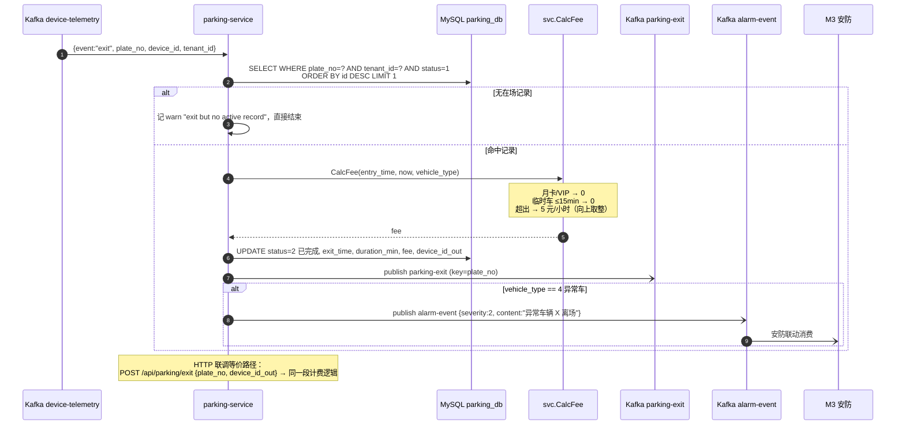
```mermaid
sequenceDiagram
    autonumber
    participant KQ as Kafka device-telemetry
    participant PA as parking-service
    participant DB as MySQL parking_db
    participant FEE as svc.CalcFee
    participant K1 as Kafka parking-exit
    participant K2 as Kafka alarm-event
    participant M3 as M3 安防

    KQ->>PA: {event:"exit", plate_no, device_id, tenant_id}
    PA->>DB: SELECT WHERE plate_no=? AND tenant_id=? AND status=1<br/>ORDER BY id DESC LIMIT 1
    alt 无在场记录
        PA->>PA: 记 warn "exit but no active record"，直接结束
    else 命中记录
        PA->>FEE: CalcFee(entry_time, now, vehicle_type)
        Note over FEE: 月卡/VIP → 0<br/>临时车 ≤15min → 0<br/>超出 → 5 元/小时（向上取整）
        FEE-->>PA: fee
        PA->>DB: UPDATE status=2 已完成, exit_time, duration_min, fee, device_id_out
        PA-)K1: publish parking-exit (key=plate_no)
        alt vehicle_type == 4 异常车
            PA-)K2: publish alarm-event {severity:2, content:"异常车辆 X 离场"}
            K2-)M3: 安防联动消费
        end
    end

    Note over PA: HTTP 联调等价路径：<br/>POST /api/parking/exit {plate_no, device_id_out} → 同一段计费逻辑
```

### 4.5 公告发布与推送

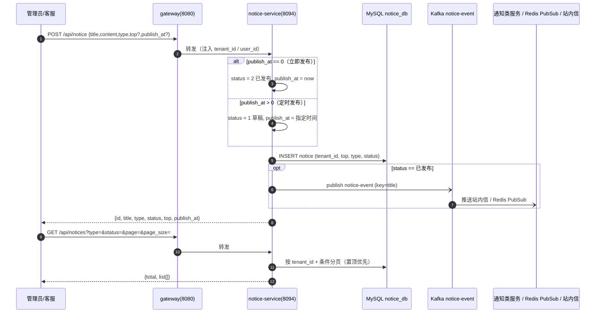
```mermaid
sequenceDiagram
    autonumber
    participant AD as 管理员/客服
    participant GW as gateway(8080)
    participant NO as notice-service(8094)
    participant DB as MySQL notice_db
    participant KQ as Kafka notice-event
    participant SUB as 通知类服务 / Redis PubSub / 站内信

    AD->>GW: POST /api/notice {title,content,type,top?,publish_at?}
    GW->>NO: 转发（注入 tenant_id / user_id）
    alt publish_at == 0（立即发布）
        NO->>NO: status = 2 已发布, publish_at = now
    else publish_at > 0（定时发布）
        NO->>NO: status = 1 草稿, publish_at = 指定时间
    end
    NO->>DB: INSERT notice (tenant_id, top, type, status)
    opt status == 已发布
        NO-)KQ: publish notice-event (key=title)
        KQ-)SUB: 推送站内信 / Redis PubSub
    end
    NO-->>AD: {id, title, type, status, top, publish_at}

    AD->>GW: GET /api/notices?type=&status=&page=&page_size=
    GW->>NO: 转发
    NO->>DB: 按 tenant_id + 条件分页（置顶优先）
    NO-->>AD: {total, list[]}
```

### 4.6 M5 大屏聚合（gRPC ListWorkOrders）

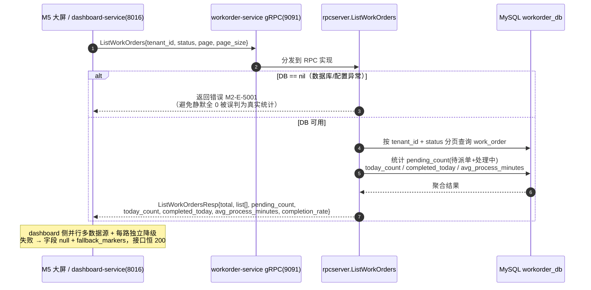
```mermaid
sequenceDiagram
    autonumber
    participant SC as M5 大屏 / dashboard-service(8016)
    participant GRPC as workorder-service gRPC(9091)
    participant SRV as rpcserver.ListWorkOrders
    participant DB as MySQL workorder_db

    SC->>GRPC: ListWorkOrders{tenant_id, status, page, page_size}
    GRPC->>SRV: 分发到 RPC 实现
    alt DB == nil（数据库/配置异常）
        SRV-->>SC: 返回错误 M2-E-5001<br/>（避免静默全 0 被误判为真实统计）
    else DB 可用
        SRV->>DB: 按 tenant_id + status 分页查询 work_order
        SRV->>DB: 统计 pending_count(待派单+处理中)<br/>today_count / completed_today / avg_process_minutes
        DB-->>SRV: 聚合结果
        SRV-->>SC: ListWorkOrdersResp{total, list[], pending_count,<br/>today_count, completed_today, avg_process_minutes, completion_rate}
    end
    Note over SC: dashboard 侧并行多数据源 + 每路独立降级<br/>失败 → 字段 null + fallback_markers，接口恒 200
```

### 4.7 请求统一入口：网关鉴权与上下文注入链

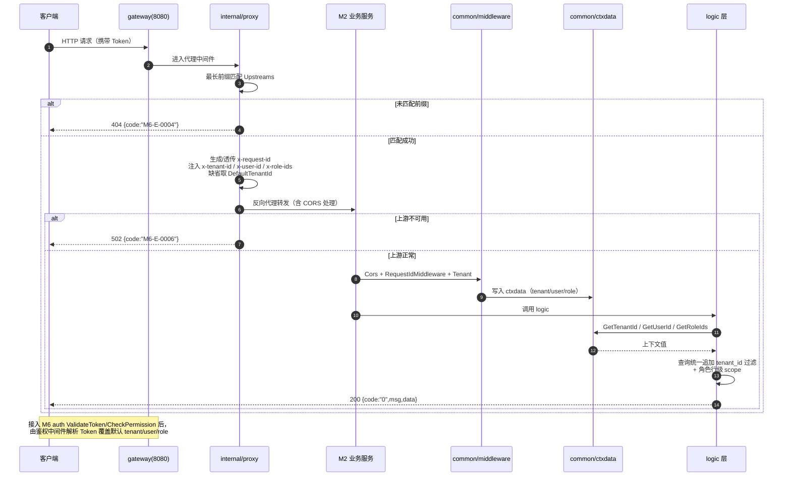
```mermaid
sequenceDiagram
    autonumber
    participant C as 客户端
    participant GW as gateway(8080)
    participant PX as internal/proxy
    participant SV as M2 业务服务
    participant MW as common/middleware
    participant CD as common/ctxdata
    participant LG as logic 层

    C->>GW: HTTP 请求（携带 Token）
    GW->>PX: 进入代理中间件
    PX->>PX: 最长前缀匹配 Upstreams
    alt 未匹配前缀
        PX-->>C: 404 {code:"M6-E-0004"}
    else 匹配成功
        PX->>PX: 生成/透传 x-request-id<br/>注入 x-tenant-id / x-user-id / x-role-ids<br/>缺省取 DefaultTenantId
        PX->>SV: 反向代理转发（含 CORS 处理）
        alt 上游不可用
            PX-->>C: 502 {code:"M6-E-0006"}
        else 上游正常
            SV->>MW: Cors + RequestIdMiddleware + Tenant
            MW->>CD: 写入 ctxdata（tenant/user/role）
            SV->>LG: 调用 logic
            LG->>CD: GetTenantId / GetUserId / GetRoleIds
            CD-->>LG: 上下文值
            LG->>LG: 查询统一追加 tenant_id 过滤<br/>+ 角色行级 scope
            LG-->>C: 200 {code:"0",msg,data}
        end
    end
    Note over GW,C: 接入 M6 auth ValidateToken/CheckPermission 后，<br/>由鉴权中间件解析 Token 覆盖默认 tenant/user/role
```

---

## 五、接口与流程对照索引

| # | 流程 / 图 | 关联接口 | 涉及服务 | 关键文件 |
| --- | --- | --- | --- | --- |
| 1 | 工单建单 | `POST /api/workorder` | workorder | `logic/createworkorderlogic.go` |
| 2 | 工单派单 | `PUT /api/workorder/:id/assign` | workorder | `logic/assignworkorderlogic.go` |
| 3 | 工单状态流转 | `PUT /api/workorder/:id/status` | workorder | `logic/updateworkorderstatuslogic.go`、`state/fsm.go` |
| 4 | 工单查询 | `GET /api/workorder/:id`、`GET /api/workorders` | workorder | `logic/getworkorderlogic.go`、`listworkorderslogic.go` |
| 5 | 大屏聚合 | gRPC `ListWorkOrders` | workorder → M5 | `internal/rpcserver/server.go`、`proto/workorder/workorder.proto` |
| 6 | 访客邀请 | `POST /api/visitor/invite` | visitor | `logic/visitorinvitelogic.go` |
| 7 | 访客签入 | `POST /api/visitor/checkin` | visitor → M1 | `logic/visitorcheckinlogic.go` |
| 8 | 访客签出 | `POST /api/visitor/checkout` | visitor | `logic/visitorcheckoutlogic.go` |
| 9 | 访客记录 | `GET /api/visitors` | visitor | `logic/listvisitorslogic.go` |
| 10 | 车辆入场 | `POST /api/parking/entry` / Kafka `entry` | parking | `logic/parkingentrylogic.go`、`svc/consumer.go` |
| 11 | 车辆离场计费 | `POST /api/parking/exit` / Kafka `exit` | parking | `logic/parkingexitlogic.go`、`svc/consumer.go#CalcFee` |
| 12 | 停车记录/在场 | `GET /api/parking/records`、`GET /api/parking/active` | parking | `logic/listparkinglogic.go`、`activeparkinglogic.go` |
| 13 | 公告发布 | `POST /api/notice` | notice | `logic/createnoticelogic.go` |
| 14 | 公告列表 | `GET /api/notices` | notice | `logic/listnoticeslogic.go` |

### 事件主题索引（`common/kafka/topics.go`）

| 主题 | 生产方 | 消费方 | 触发点 |
| --- | --- | --- | --- |
| `device-telemetry` | M1 event-dispatcher | parking-service（组 `parking-service`） | 地磁/门禁设备上报 |
| `parking-entry` | parking-service | 大屏 / 告警类服务 | 车辆入场 |
| `parking-exit` | parking-service | 大屏 / 告警类服务 | 车辆离场 |
| `alarm-event` | parking-service（异常车辆）/ M3 | M3 安防 | 异常车辆离场等 |
| `notice-event` | notice-service | 通知类服务 | 公告发布成功 |
| `workorder-event` | workorder-service（组 `workorder-service`） | M5 / 通知类服务 | 建单 `created` / 派单 `assigned` / 流转 `status_changed` |

---

## 六、图集维护约定

1. 图中端口、路径、状态码一律以 `.api` 契约与 `state/fsm.go` 为准，改代码须同步改图。
2. 新增接口时，需同步更新"1.1 功能架构图""五、接口与流程对照索引"，并补充对应时序图。
3. 状态机新增状态/动作时，必须同步更新"三、流转图"及其转移表。
4. 该文档为 M2 模块对外交付材料，改动请随 PR 一起提交至 `docs/`。
