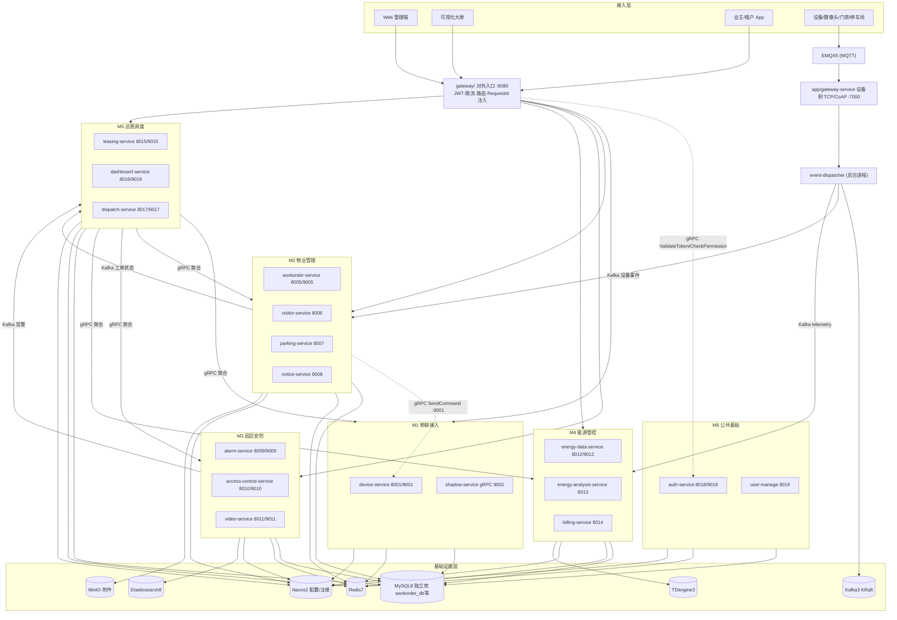

# 智慧园区项目 M2 物业管理服务模块设计文档（V1.1 · 对齐 onepark-smart-park 实际工程）

> **项目名称：** 智慧园区管理平台（OnePark，基于中移物联 OnePark APaaS 二次开发）
> **模块名称：** M2 物业管理服务（Property Service）
> **负责人：** Golang 后端开发（M2 负责人）
> **技术栈：** Go 1.25 + go-zero（API / RPC / Gateway）+ GORM + MySQL 8 + Redis 7 + Kafka 3 + gRPC/Protobuf
> **工程现状：** Monorepo 脚手架阶段 —— `.api` / `.proto` 当前为 goctl 占位（`Ping`），本文件作为填充规范

> ⚠️ 本文档所有约定均对齐 `onepark-smart-park` 仓库实际结构（`README.md`、`go.work`、`proto/`、`common/`、`deploy/sql/init.sql`），接口清单取自《OnePark 接口与链路技术点清单》。

---

## 一、模块定位（对齐实际端口与结构）

| 维度 | 内容 |
| --- | --- |
| 模块名称 | M2 物业管理服务 |
| 服务数 | 4 个微服务（均在 `app/` 下独立 go module） |
| 接口数量 | 16 个（15 HTTP + 1 gRPC） |
| 实际端口 | workorder **HTTP 8005 / gRPC 9005**、visitor **HTTP 8006**、parking **HTTP 8007**、notice **HTTP 8008** |
| 技术栈 | go-zero、GORM、MySQL、Redis、Kafka（与全局一致） |
| 核心职责 | 园区日常物业运营：工单、访客、停车、公告 |
| 依赖中间件 | MySQL(`workorder_db`等独立库)、Redis、Kafka、MinIO(附件)、M1 gRPC、M6 鉴权 |

> 全局入口为根目录 `gateway/` 服务（HTTP `:8080`，负责 JWT/限流/路由/RequestId 注入），**不是** `app/gateway-service/`（那是 M1 面向设备的 TCP/CoAP 接入网关，端口 `7000`）。M2 各服务只暴露内网端口，统一经对外网关路由。

---

## 二、建设目标

构建统一物业业务平台，实现：

- 工单闭环管理（报修/投诉/巡检/保洁/装修/搬运）
- 访客线上预约与门禁联动
- 停车自动计费
- 公告统一发布与已读统计
- 与设备联动（M1 gRPC 开门、Kafka 停车事件）
- 与运营平台数据互通（M5 gRPC 聚合 + Kafka 事件）

---

## 三、服务拆分与核心功能（对齐端口表）

M2 在仓库中对应 4 个目录：`app/workorder-service`、`app/visitor-service`、`app/parking-service`、`app/notice-service`。

### 1. `workorder-service`（工单服务）HTTP `:8005` / gRPC `:9005`

| 接口 | 方法 | 核心功能 | 落地文件 |
| --- | --- | --- | --- |
| `/api/workorder` | POST | 创建工单（报修/巡检/清洁） | `workorder.api` |
| `/api/workorder/:id/assign` | PUT | 派单：分配处理人，状态流转为“处理中” | `workorder.api` |
| `/api/workorder/:id/status` | PUT | 更新工单状态（提交完成/验收通过/驳回） | `workorder.api` |
| `/api/workorder/:id` | GET | 查询工单详情 | `workorder.api` |
| `/api/workorders` | GET | 工单分页列表（状态/类型/处理人筛选） | `workorder.api` |
| `ListWorkOrders` | gRPC | 供 M5 大屏查询“待处理工单数” | `proto/workorder/workorder.proto` |

**关键能力**：工单生命周期状态机、派单与验收、状态变更审计、向 M5 发 Kafka 事件。
**说明**：当前 `proto/workorder/workorder.proto` 仅有 `Ping`，需按本文件补充 `ListWorkOrders`（及后续可能的 `GetStatistics`）。

### 2. `visitor-service`（访客服务）HTTP `:8006`

| 接口 | 方法 | 核心功能 |
| --- | --- | --- |
| `/api/visitor/invite` | POST | 业主/物业发起访客邀请，生成二维码 |
| `/api/visitor/checkin` | POST | 访客扫码签入，核销二维码并开门 |
| `/api/visitor/checkout` | POST | 访客签出 |
| `/api/visitors` | GET | 访客记录分页列表 |

**关键能力**：二维码生成与加密、一次性核销、跨模块 gRPC 调用 M1 下发开门指令（`proto/device` 的 `SendCommand`）。
**说明**：当前 `proto/device/device.proto` 仅有 `Ping`，需补充 `SendCommand`（参数 `device_id`、`command`、`params`）。

### 3. `parking-service`（停车服务）HTTP `:8007`

| 接口 | 方法 | 核心功能 |
| --- | --- | --- |
| `/api/parking/entry` | POST | 车辆入场：车牌识别记录 |
| `/api/parking/exit` | POST | 车辆离场：计算停车费 |
| `/api/parking/records` | GET | 停车记录分页列表 |
| `/api/parking/active` | GET | 在场车辆列表 |

**关键能力**：消费 M1 Kafka 设备事件、车牌解析、停车计费、在场车辆缓存。

### 4. `notice-service`（公告通知服务）HTTP `:8008`

| 接口 | 方法 | 核心功能 |
| --- | --- | --- |
| `/api/notice` | POST | 发布公告/通知 |
| `/api/notices` | GET | 公告列表 |

**关键能力**：公告发布、站内信/Redis PubSub 推送。

---

## 四、用户角色与权限（对齐 M6 RBAC 五表）

权限统一由 **M6 认证服务 + Gateway** 负责（RBAC 五表位于 `user_db`：`user`/`role`/`permission`/`user_role`/`role_permission`）。

| 角色 | 职责 | 涉及服务 |
| --- | --- | --- |
| 园区管理员 | 发布公告、查看全部工单/访客/停车记录、分配工单 | workorder/visitor/parking/notice |
| 物业客服 | 受理工单、派单、发布公告 | workorder/notice |
| 物业维修人员 | 接单、处理、提交完成 | workorder-service |
| 业主/企业租户 | 提交报修、发起访客邀请、查看公告 | workorder/visitor/notice |
| 保安 | 审核访客、查看门禁记录 | visitor |
| 停车管理员 | 管理停车记录、收费规则 | parking |
| 系统管理员 | 权限配置、系统配置 | 全部（经 M6） |
| 访客 | 扫码签入/签出 | visitor-service |
| 系统/设备 | 车牌识别入场/离场、自动产生停车记录 | parking-service |

> 网关层在 `ctxdata` 中注入 `x-user-id`、`x-role-ids`、`x-tenant-id`，M2 各 logic 直接从 context 取当前用户，不自行解析 JWT。

---

## 五、功能模块详细设计

### 5.1 工单管理（WorkOrder）
支持类型：报修/投诉/巡检/保洁/装修申请/搬运申请/其他。
- **创建**：APP 提交、管理后台创建、自动创建（M3/M4 告警触发）。附件（图片）存 **MinIO**，DB 仅存对象 Key。
- **派发**：指定维修人员、部门、优先级。
- **处理**：接单、开始处理、上传照片、填写结果。
- **验收**：满意/不满意/重新处理。
- **统计**：今日工单、未完成、平均处理时间、完成率。

**状态流转**（待受理→待派单→处理中→待验收→已完成；异常：处理中→驳回→重新处理；取消：待受理→已取消）。

### 5.2 访客管理（Visitor）
- **邀请**：姓名、手机号、来访时间、来访原因 → 生成二维码。
- **门岗验证**：二维码/手机号/身份证 → 调 M1 开门。
- **记录**：到访/离开时间、门禁记录。
- **黑名单**：拉黑、自动禁止预约。

### 5.3 停车管理（Parking）
- 数据来源：M1 停车设备 Kafka 事件。
- 收费：免费时长/按小时/封顶；月卡/临时/VIP/异常车辆。

### 5.4 公告管理（Notice）
- 公告/通知/活动/停水/停电；定时发布、撤回、已读统计。

---

## 六、典型业务场景

（与 V1.0 一致，补充技术实现注记）

### 场景一：业主报修
住户 APP 提交 → `workorder-service` 生成工单号（状态“待派单”）→ 客服派单（“处理中”）→ 维修提交（“待验收”）→ 住户验收（“已完成”/驳回“处理中”）→ 状态变更发 Kafka `onepark.workorder.status_changed`，M5 大屏感知。

### 场景二：访客通行
邀请生成带有效期二维码 → 扫码 `/visitor/checkin` → Redis `SET NX` 一次性核销 → gRPC 调 M1 `SendCommand(open_door)`（短超时）→ 记录签入 → 离园签出。

### 场景三：停车计费
M1 经 Kafka 发车辆入场事件 → `parking-service` 消费写 `parking_db` → 离场再次消费，按规则算费（shopspring/decimal）→ 查询历史/在场。

### 场景四：异常自动派单
M3 报警 / M4 能源异常 → Kafka → M2 自动生成维修/巡检工单 → 派单处理。

---

## 七、数据对象设计（DDD 初分，对齐独立库约束）

> 每服务独立数据库，**禁止跨库 JOIN**；同库内可用 GORM 关联（`Preload`）。

### 1. 工单域（`workorder_db`）
```go
WorkOrder {
    ID            int64
    OrderNo       string      // WO-20260913-0001
    Type          int8
    Title, Description string
    ReporterID, AssigneeID, DepartmentID int64
    Status        int8        // 待受理/待派单/处理中/待验收/已完成/已关闭/已驳回
    Priority      int8
    Location      string
    Attachments   string      // MinIO 对象 Key 列表(JSON)
    Version       int64       // 乐观锁
    CreatedAt, UpdatedAt time.Time
    FinishedAt    *time.Time
}
// 关联: work_order_flow(操作流水) work_order_attachment(MinIO 附件)
```

### 2. 访客域（`visitor_db`）
```go
VisitorRecord {
    ID int64; InviterID int64
    VisitorName, VisitorPhone string
    VisitTime, ExpireTime time.Time
    QRCode string            // 加密内容
    Status int8              // 待使用/已签入/已签出/已过期
    CheckinAt, CheckoutAt *time.Time
    DeviceID string; Blacklisted bool
    CreatedAt time.Time
}
```

### 3. 停车域（`parking_db`）
```go
ParkingRecord {
    ID int64; PlateNo string
    EntryTime time.Time; ExitTime *time.Time
    DurationMin int; Fee decimal.Decimal
    VehicleType int8          // 月卡/临时/VIP/异常
    Status int8               // 停车中/已完成
    DeviceIDIn, DeviceIDOut string
    CreatedAt time.Time
}
// parking_fee_rule: 计费规则(JSON 存储)
```

### 4. 公告域（`notice_db`）
```go
Notice {
    ID int64; Title, Content string
    Type int8                 // 通知/公告/活动/停水/停电
    PublisherID int64; Top bool
    Status int8               // 草稿/已发布/已撤回
    PublishAt *time.Time      // 定时发布
    CreatedAt time.Time
}
// notice_read: 已读记录
```

---

## 八、关键流程

### 1. 工单状态机
```
待派单 --(assign)--> 处理中 --(submit)--> 待验收 --(approve)--> 已完成
                                      \--(reject)--> 处理中
待验收 --(close)--> 已关闭
```
> FSM 用 `map[Status]map[Action]Status` 校验；GORM `version` 乐观锁防并发派单。

### 2. 访客二维码核销
```
POST /visitor/checkin → 解析二维码 → 校验有效期 →
Redis SET NX {qr}:used EX ttl → gRPC M1 SendCommand(open_door) →
更新 VisitorRecord 已签入 → 返回
```

### 3. 停车事件消费
```
设备→EMQX→M1 event-dispatcher→Kafka(onepark.device.event)→
parking-service 消费→解析 plateNo+deviceId→
入场建记录(status=停车中)/离场算费更新
```

---

## 九、数据库设计（对齐 init.sql 独立库）

`deploy/sql/init.sql` 已预建：`workorder_db`、`visitor_db`、`parking_db`、`notice_db`（及 M6 `user_db` 含 RBAC 五表）。每服务只访问本库。

**索引要点**：工单 `(status,type,assignee_id,created_at)`；访客 `qr_code` 唯一、`status+visit_time`；停车 `plate_no+entry_time`、`status`；工单表加 `version`；附件/规则用 `datatypes.JSON` 或 MinIO Key。

---

## 十、模块交互设计（对齐实际模块与端口）

### 与 M1 物联接入（`device` HTTP 8001 / gRPC 9001；shadow gRPC 9002）
- **接收**：停车事件、门禁事件、设备状态（Kafka / gRPC）
- **调用**：`DeviceService.SendCommand`（gRPC 9001）开门

### 与 M3 安防（alarm 8009/9009）
- 接收消防/视频/周界报警（Kafka）→ 自动生成维修工单

### 与 M4 能源（energy-data 8012/9012）
- 接收水/电表异常（Kafka）→ 自动生成巡检工单

### 与 M5 运营调度（dashboard 8016/9016）
- 提供：工单/停车/访客统计、实时数据（gRPC `ListWorkOrders` + Kafka）

### 与 M6 公共基础（auth 8018/9018；user-manage 8019）
- Gateway 统一 JWT 鉴权 + RBAC；操作日志

### 交互点汇总

| 方向 | 模块 | 方式 | 场景 |
| --- | --- | --- | --- |
| M2 → M1 | 物联 | gRPC `SendCommand` | 访客开门 |
| M1 → M2 | 物联 | Kafka | 停车入场/离场事件 |
| M2 → M5 | 运营 | Kafka | 工单状态变更 |
| M5 → M2 | 运营 | gRPC `ListWorkOrders` | 大屏聚合 |
| M6 → M2 | 公共 | Gateway 鉴权/RBAC | 所有接口 |

---

## 十一、接口设计（建议，遵循 go-zero `v1` 语法）

在 `app/<svc>/<svc>.api` 中按 goctl 规范补充（替换当前占位）。示例：

```go
// workorder.api
type CreateWorkOrderReq {
    Type      int8   `json:"type"`
    Title     string `json:"title"`
    Content   string `json:"content"`
    Priority  int8   `json:"priority"`
    Location  string `json:"location"`
}
type WorkOrderResp { Id int64 `json:"id"` OrderNo string `json:"order_no"` Status int8 `json:"status"` }

service workorder-api {
    @handler CreateWorkOrder  POST /api/workorder          (CreateWorkOrderReq) returns (WorkOrderResp)
    @handler AssignWorkOrder  PUT  /api/workorder/:id/assign (AssignReq)        returns (WorkOrderResp)
    @handler UpdateWorkOrderStatus PUT /api/workorder/:id/status (StatusReq)    returns (WorkOrderResp)
    @handler GetWorkOrder     GET  /api/workorder/:id      (IdReq)             returns (WorkOrderDetail)
    @handler ListWorkOrders   GET  /api/workorders         (ListReq)           returns (WorkOrderList)
}
```

> 统一响应体见 `common/response`：`{code,msg,data}`，成功 `code="0"`。所有 handler 通过 `response.Ok` / `response.Fail` 回包。

---

## 十二、项目架构图（对齐真实端口/模块）



---

## 十三、技术实现建议（对齐 go-zero 工程实际）

### 13.1 工程结构（Monorepo，go.work 22 module）
```
onepark-smart-park/
├── gateway/                # 对外入口 :8080
├── app/
│   ├── workorder-service/  # M2 工单 (独立 go module)
│   │   ├── workorder.api   # 接口定义(当前占位,需补)
│   │   ├── workorder.go     # 入口
│   │   ├── etc/             # yaml 配置(${VAR} 占位)
│   │   └── internal/
│   │       ├── config/ handler/ logic/ svc/ types/   # goctl 生成
│   │       └── model/        # goctl model mysql 生成(实体+DAO)
│   ├── visitor-service/  parking-service/  notice-service/   # 同构
├── proto/                  # 独立 module onepark/proto
│   ├── workorder/  device/  ...   # 每服务 .proto + .pb.go
│   └── common/             # Empty 等公共消息
├── common/                 # 共享 onepark/common
│   ├── response/ errorx/ ctxdata/ middleware/ checks/
└── deploy/                 # docker-compose.yml + .env.example + sql/init.sql
```

> **关键规则**：gRPC 契约放 `proto/<svc>/`，服务端和调用方都 `import onepark/proto/<svc>`；**业务服务之间不互相依赖 module**。`goctl model mysql` 生成 `internal/model`；`make genproto` 重新生成 `.pb.go`。

### 13.2 技术选型（与全局一致）
| 能力 | 方案 |
| --- | --- |
| API/RPC/Gateway | go-zero（`goctl api` / `goctl rpc`） |
| ORM | GORM v2（每服务本库） |
| 缓存 | go-redis v9 |
| Kafka | sarama / kafka-go（消费组） |
| 二维码 | skip2/go-qrcode |
| 金额 | shopspring/decimal |
| 配置/注册 | **Nacos 2** |
| 对象存储 | **MinIO**（工单/访客附件） |
| 状态机 | 本地 `map` 转移表 |

### 13.3 各服务落地任务
**workorder-service**
- 在 `workorder.api` 补 5 个 HTTP 接口；`proto/workorder` 补 `ListWorkOrders` 后 `make genproto`
- `goctl model mysql` 生成 `work_order`/`work_order_flow`/`work_order_attachment`
- 工单号：`pkg/orderno` 或 Redis 自增；FSM；乐观锁；状态变更发 Kafka

**visitor-service**
- `visitor.api` 补 4 接口；二维码 HMAC/AES 签名 + 有效期；Redis `SET NX` 核销
- 调用 `onepark/proto/device.SendCommand`（需在 `proto/device` 补 `SendCommand`），context 短超时

**parking-service**
- `parking.api` 补 4 接口；Kafka 消费者（订阅 `onepark.device.event`，过滤停车设备）
- `goctl model mysql` 生成 `parking_record`/`parking_fee_rule`；计费引擎；在场车辆 Redis 缓存；按 requestId 幂等

**notice-service**
- `notice.api` 补 2 接口；公告 CRUD；Redis PubSub / 站内信推送

### 13.4 公共能力（放 `common/` 或 `app/<svc>/internal`）
| 能力 | 位置/用途 |
| --- | --- |
| 统一响应 | `common/response`：`Ok` / `Fail` |
| 错误码 | `common/errorx`：M2 前缀 `M2-E-xxxx` |
| 上下文 | `common/ctxdata`：`x-user-id`/`x-role-ids`/`x-tenant-id`/`x-request-id` |
| 中间件 | `common/middleware`：RequestId（网关注入，服务透传） |
| 状态机 | M2 内 `internal/state` 或 `pkg/fsm` |
| 分布式序号 | `pkg/orderno` |
| Kafka 封装 | 带重试/幂等/死信 |

### 13.5 接口契约（需补进 proto）
```protobuf
// proto/workorder/workorder.proto (service WorkorderService)
rpc ListWorkOrders(ListWorkOrdersReq) returns (ListWorkOrdersResp);
// 返回 pending_count / processing_count / total_today

// proto/device/device.proto (service DeviceService)
rpc SendCommand(SendCommandReq) returns (SendCommandResp);
// SendCommandReq{ device_id, command, params }
```

---

## 十四、开发计划（对齐 6 人 Monorepo 协作）

| 阶段 | 内容 |
| --- | --- |
| Sprint 1 | 补 `workorder.api`/`.proto`，`goctl model`，接入 M6 鉴权 |
| Sprint 2 | 工单 CRUD + 状态机 + 派单 |
| Sprint 3 | 访客预约 + 二维码 + M1 开门联动（需 device `SendCommand`） |
| Sprint 4 | 停车 Kafka 消费 + 计费规则 |
| Sprint 5 | 公告 + 统计 |
| Sprint 6 | M1/M3/M5 联调 + 性能/监控 |

---

## 十五、M2 开发优先级
| 优先级 | 内容 | 理由 |
| --- | --- | --- |
| P0 | workorder 核心 CRUD + 状态机 | 核心，M5 大屏依赖 |
| P0 | visitor 邀请/签入/签出 | 闭环，跨模块调 M1 |
| P1 | parking Kafka 消费 + 计费 | 依赖 M1 事件 |
| P1 | notice | 独立，快 |
| P2 | workorder gRPC 供 M5 | 大屏需要 |
| P2 | 与 M5 Kafka 联动 | 调度感知 |

---

## 十六、风险与注意点
1. **M1 `SendCommand` 未定义**：`proto/device` 当前仅 `Ping`，访客开门需先补契约并 `make genproto`。
2. **M2 `ListWorkOrders` 未定义**：`proto/workorder` 当前仅 `Ping`，大屏聚合需先补。
3. **独立库约束**：禁止跨库 JOIN，统计跨域走 gRPC/应用层聚合。
4. **附件走 MinIO**：不要存大字段到 MySQL。
5. **端口/配置**：用 `deploy/.env.example` 的 `${VAR}`，勿硬编码 8005 等端口。
6. **gRPC 超时**：访客开门设短超时，失败明确提示。
7. **Kafka 幂等**：停车事件重复消费按 requestId 去重。

---

## 十七、总结
M2 物业管理服务是 OnePark 智慧园区的**核心业务模块**，以工单为中心整合访客/停车/公告，依托 go-zero Monorepo（go.work 22 module）、`proto/` 独立契约 module、`common/` 公共包，以及 MySQL 独立库 + Redis + Kafka + MinIO 中间件，通过 gRPC + Kafka 与 M1/M3/M4/M5 联动，并经 M6 Gateway 统一鉴权。本文档所有约定均对齐 `onepark-smart-park` 实际工程，可作为填充 `.api`/`.proto` 与落地各服务的规范依据。
