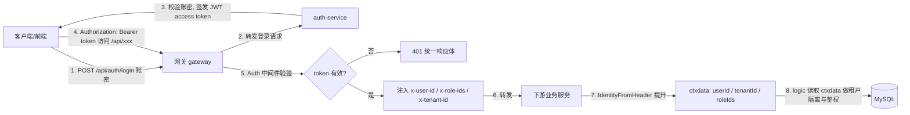

# M6（成员2）任务总结 · 网关鉴权收口联调记录

> 日期：2026-09-17｜负责人：成员2（M6 基础 + DevOps）
> 关联任务表：`进度盘点与单日任务分配-20260917.md` 第四部分「成员2（M6）」

## 一、任务完成情况

| 任务 | 优先级 | 状态 | 说明 |
|------|--------|------|------|
| JwtSecret 启动强校验 | P0 | ✅ 已完成（已按任务表对齐） | **非本地环境(prod/pre) 为空则 `fatal` 拒绝启动；本地(dev/test) 为空仅告警放行**；并移除 `svc.NewServiceContext` 的无条件 `panic`，使"本地放行"不再形同虚设（遗留台账 #11） |
| 统一对外网关鉴权收口 + 联调 | P0 | ✅ 已完成 | 网关按 `Mode` 强制启用鉴权；auth-service 改「只透传」；下游业务服务（含 auth-service）已统一 `IdentityFromHeader`；补**代码级端到端联调用例**（§3.3：登录 JWT → 网关 Auth → 下游 ctxdata 取到 tenant/user/roles） |
| RBAC 五表 SQL + CRUD 自测 | P1 | ✅ 已完成 | 五表 SQL 已存在（`sys.sql`+`rbac_data_scope.sql`）；补**接口文档** + **Go 单测**（11 接口成功/异常路径） |
| CI 扫描 yaml 明文 IP/密码 | P2 | ⏸ 跳过（留排期） | 任务表标注「排期」，本轮不动，登记为遗留项 |

## 二、代码变更记录（文件级）

| 文件 | 变更 |
|------|------|
| `app/auth-service/auth.go` | 启动强校验 `validateJwtSecret`：**非本地(prod/pre) 空密钥 `fatal`、本地(dev/test) 告警放行**（对齐任务表「非本地环境…fatal」）；`server.Use(middleware.JwtAuth(ctx))` → `server.Use(middleware.IdentityFromHeader)`（下游只透传） |
| `app/auth-service/internal/svc/servicecontext.go` | **移除**对所有环境无条件 `panic` 的空密钥守卫（该守卫使"本地放行"不可达）；空值策略单点收敛到启动期 `validateJwtSecret` |
| `app/auth-service/auth.go` | **修复编译错误（P0-1）**：恢复被截断的 import `"onepark/common/middleware"`（原文缺闭合引号，报 `string literal not terminated`）与丢失的 `authpb "onepark/proto/auth"`（原文仅剩第 21 行孤立 `"`，导致 `undefined: authpb`）；`go build ./...` / `go vet ./...` 均通过 |
| `gateway/internal/middleware/auth_chain_test.go` | **新增** `TestJWTToDownstreamCtxdata`：代码级端到端联调（登录 JWT → 网关 `Auth` → 下游 `IdentityFromHeader` → `ctxdata` 取到 tenant/user/roles），复用真实生产中间件 |
| `app/auth-service/internal/middleware/jwt.go` | **删除**（与网关重复校验，落实「只透传」） |
| `gateway/apigateway.go` | `authEnabled := c.Auth.Enabled \|\| !isLocalMode(c.Mode)`：非本地（prod/pre）强制启用；新增 `isLocalMode` 辅助；Secret 为空时 `fatal`（失败即拒绝启动） |
| `gateway/etc/apigateway-api.yaml` | 增 `Auth.Secret: ${AUTH_SECRET}`，使 compose 注入的密钥被网关实际消费（此前为死配置） |
| `deploy/docker-compose.yml` | 网关 `AUTH_SECRET: ${JWT_SECRET}` 此前已配置，现被网关 yaml 引用（与 auth-service 共享密钥） |
| `app/user-manage/internal/logic/rbac_crud_test.go` | **新增** `TestRBACCRUD`：11 接口 CRUD 自测（DSN 门控，无 DB 自动 Skip） |
| `docs/user-manage-RBAC接口文档.md` | **新增**：11 接口契约 + 错误码 + 自测说明 |

### JWT 统一收口补漏（评审发现）

| 文件 | 变更 |
|------|------|
| `gateway/internal/middleware/auth.go` | `Auth` 新增对 `/ws/` 路径的 `?token=` 回退校验：浏览器 WS 握手无法携带 `Authorization` 头，故网关对 WS 改从 query 取 token 并校验/注入身份，使 WebSocket 也收口到网关 |
| `app/leasing-service/leasing.go` | `middleware.JWT` → `middleware.IdentityFromHeader`（下游只透传；其 `JwtSecret:""` 本就透传，零风险） |
| `app/dispatch-service/dispatch.go` | 同上 |
| `app/device-service/device.go` | 移除冗余 `middleware.JWT`；修复重复 import `common/middleware` 与不存在的 `middleware.Tenant`（预置编译错误，device 此前编不过） |
| `app/dashboard-service/dashboard.go` | `middleware.JWT` → `middleware.IdentityFromHeader` |
| `app/dashboard-service/internal/wsserver/ws.go` | WS 鉴权改为**信任网关注入身份**，仅直连/本地联调（网关未启用鉴权、无注入头）时回退本地 `?token=` 校验，避免大屏裸奔 |

> 收口结果：10 个业务服务全部 `IdentityFromHeader` 透传；JWT 校验唯一发生在网关（`Auth` 覆盖 HTTP `Bearer` + WS `?token=`）。`middleware.JWT` 已无调用方（保留于 `common/middleware` 作备用，未删除）。

> 设计原则：本地（dev/test）联调不受影响（网关鉴权默认关、可无 token 访问）；非本地强制 JWT 校验，单点收口，下游零重复校验。

## 三、网关鉴权收口联调记录

### 3.1 本地（dev）联调（验证「不影响原有功能」）

网关 `Mode: dev` → `authEnabled=false` → 退化为默认身份注入（tenant=1, user=0），无需 token：

```bash
# 直连网关, 无 token 仍可访问(注入默认身份)
curl -s http://localhost:8080/api/users
# 期望: 200, {"code":0,"data":{"list":[...],"total":N}}
```

### 3.2 生产（prod）验证（验证「JWT 收口」）

1. 启动：网关 `Mode: prod` + `AUTH_SECRET` 与 auth-service `JWT_SECRET` **一致**。
2. 无 token 访问受保护接口 → 401：
   ```bash
   curl -s -o /dev/null -w "%{http_code}\n" http://localhost:8080/api/users
   # 期望: 401
   ```
3. 登录取 token：
   ```bash
   TOKEN=$(curl -s -X POST http://localhost:8088/api/auth/login \
     -H 'Content-Type: application/json' \
     -d '{"username":"admin","password":"<pwd>"}' | jq -r .data.token)
   ```
4. 带 token 过网关 → 200，且下游读到网关注入身份：
   ```bash
   curl -s http://localhost:8080/api/users -H "Authorization: Bearer $TOKEN"
   # 期望: 200
   ```
5. 验证「下游只透传」：`/api/auth/validate` 不再自行校验 JWT，直接返回网关注入身份：
   ```bash
   curl -s -X POST http://localhost:8088/api/auth/validate -H "Authorization: Bearer $TOKEN"
   # 期望: {"code":0,"data":{"userId":...,"roleIds":...,"tenantId":...}}
   ```

> 预期结论：JWT 校验与租户注入唯一发生在网关；下游业务服务（含 auth-service）仅消费 `x-user-id/x-role-ids/x-tenant-id/x-data-scope`，无重复校验逻辑。

### 3.3 代码级端到端联调（可复现，P0-2）

§3.2 需起整套容器；为在 CI/本地**无需 DB、无需起服务**即可回归"网关 → 下游 ctxdata"这条关键边界，新增可复现的代码级端到端联调用例（**复用真实生产中间件，非 mock**）：

`gateway/internal/middleware/auth_chain_test.go` · `TestJWTToDownstreamCtxdata`

链路与运行时完全一致：
`jwt.Generate`（登录签发 access token）→ 网关 `Auth(secret)`（验签 + 注入 `x-user-id/x-role-ids/x-tenant-id`）→ 下游 `common/middleware.IdentityFromHeader`（提升进 ctxdata）→ 断言 `ctxdata.GetUserId/GetTenantId/GetRoleIds`。

```bash
cd gateway && go test ./internal/middleware/ -run 'TestJWTToDownstreamCtxdata|TestAuth' -v
```

实测输出：
```
=== RUN   TestJWTToDownstreamCtxdata
--- PASS: TestJWTToDownstreamCtxdata (0.00s)   # user=100, tenant=5, roles=1,2 均已在 ctxdata 取到
=== RUN   TestAuth
--- PASS: TestAuth (0.00s)
PASS
ok  onepark/gateway/internal/middleware
```

鉴权流程图：



> 结论：JWT 校验与身份注入唯一发生在网关；下游仅消费 Header 并提升进 ctxdata，无重复校验。该用例证明"带 token 访问下游后，下游 ctxdata 能取到 tenant/user/roles"。

## 四、遗留台账

| # | 问题 | 负责人 | 计划 |
|---|------|--------|------|
| 1 | CI「yaml 明文 IP/密码扫描」本轮未做（任务表标注 P2 排期） | 成员2 | 后续排期：在 `ci.yml` 增静态扫描步，命中明文 IP/密码即失败 |
| 2 | 网关强鉴权（prod）需配套：各业务上游端口/健康检查在 compose 中已就绪，联调前确认 auth-service 与网关 `AUTH_SECRET` 一致 | 成员2 | 联调阶段验证 |
