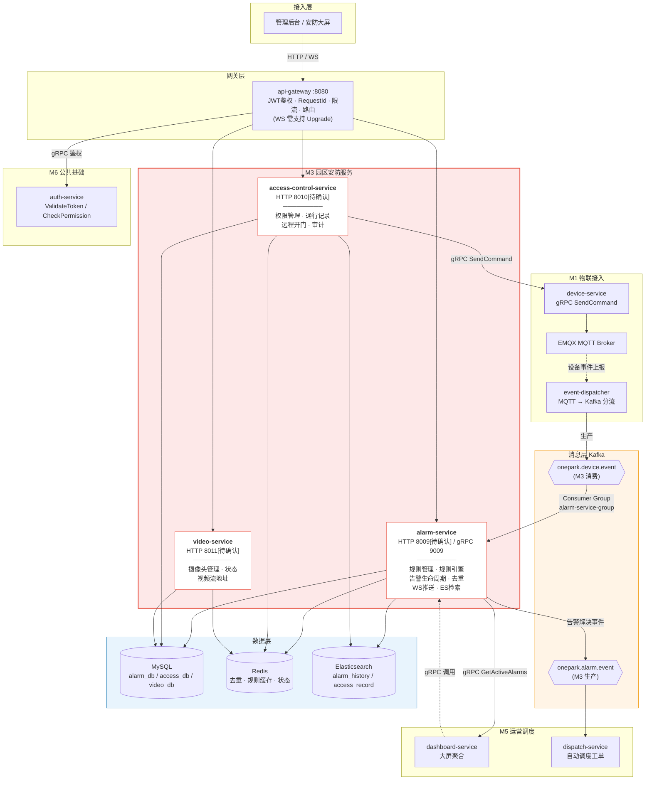
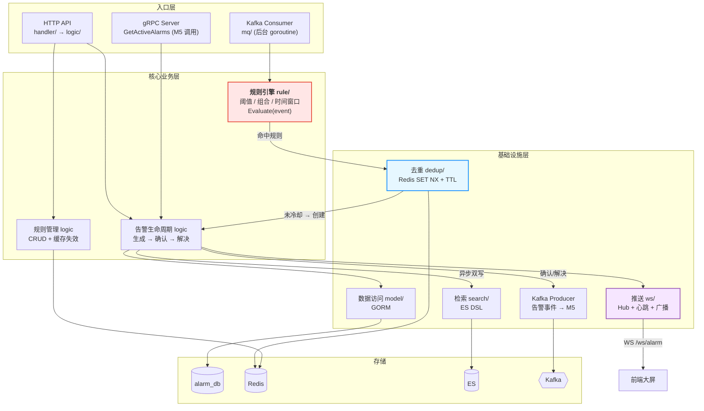
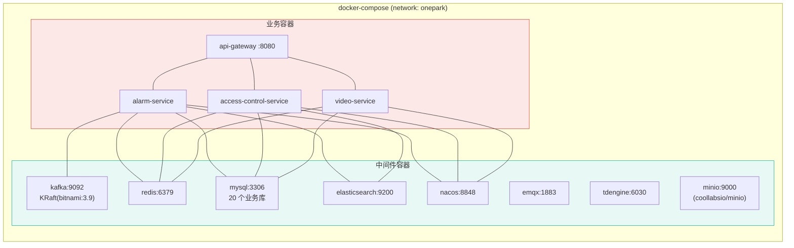

# M3 园区安防服务 — 架构图

> 配套文档：`01-M3技术方案.md` · 阶段：Day 1 · 状态：待评审
> 图中端口标注 `[待确认]` 的均因 README 与技术点清单冲突，见技术方案 §9-P0-1。

---

## 1. 整体架构图

---

## 2. alarm-service 内部模块架构（Day 2 骨架依据）

**分层铁律**：`入口层 → 核心业务层 → 基础设施层 → 存储`，禁止跨层反向调用；`rule/`、`dedup/`、`ws/`、`search/` 各自独立成包，通过 `svc.ServiceContext` 注入依赖，保证可单测。

---

## 3. 部署拓扑图（Docker Compose 网络 `onepark`）

**说明**：
- 服务通过容器名互访（如 `kafka:9092`、`redis:6379`），配置走 `${VAR}` 环境变量占位，值来自 `deploy/.env`
- M3 不直连 EMQX / TDengine / MinIO（EMQX 经 M1，TDengine 属 M4，MinIO 属文件存储）
- 中间件镜像已于 2026-09-13 修复：Kafka `bitnami/kafka:3.9`、MinIO `coollabsio/minio:latest`（原 tag 已失效）

---

## 4. 端口分配现状与待确认

| 服务                     | README 约定             | 技术点清单                 | 仓库 yaml 现状 | 结论                         |
|------------------------|-----------------------|-----------------------|------------|----------------------------|
| alarm-service          | HTTP 8009 / gRPC 9009 | HTTP 8071 / gRPC 9071 | 8888       | ⚠️ **P0-1 待确认**，建议采 README |
| access-control-service | HTTP 8010             | HTTP 8072             | 8888       | ⚠️ **P0-1 待确认**            |
| video-service          | HTTP 8011             | HTTP 8073             | 8888       | ⚠️ **P0-1 待确认**            |
| api-gateway            | HTTP 8080             | HTTP 8080             | 8888       | ⚠️ 需改为 8080                |

> **注意**：当前 19 个服务 yaml 全部为 `Port: 8888`，同时启动必然端口冲突。Day 2 必须统一改齐。
