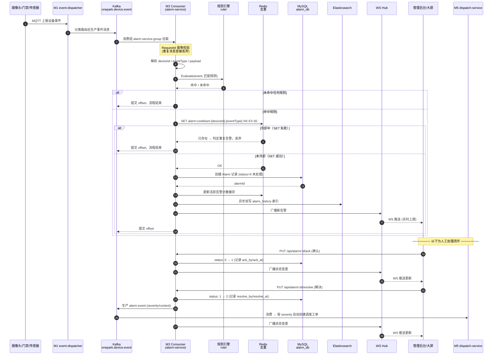
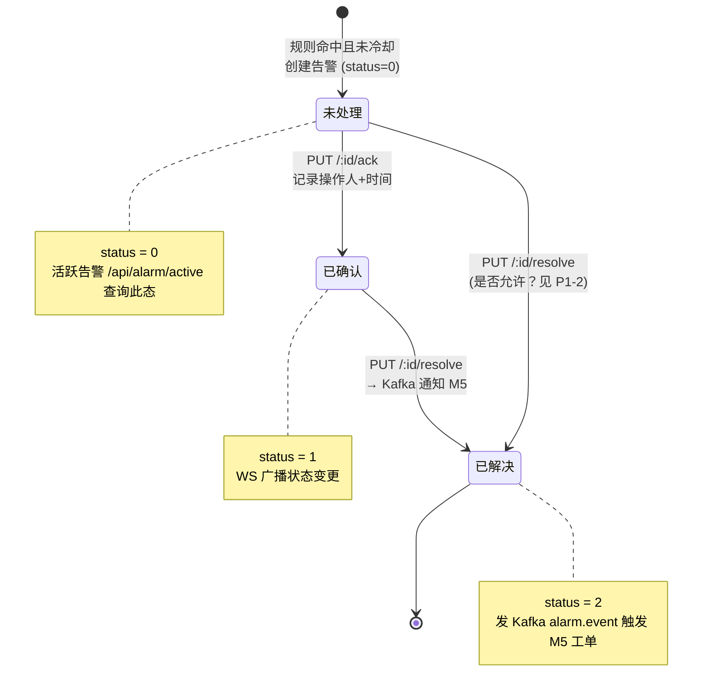
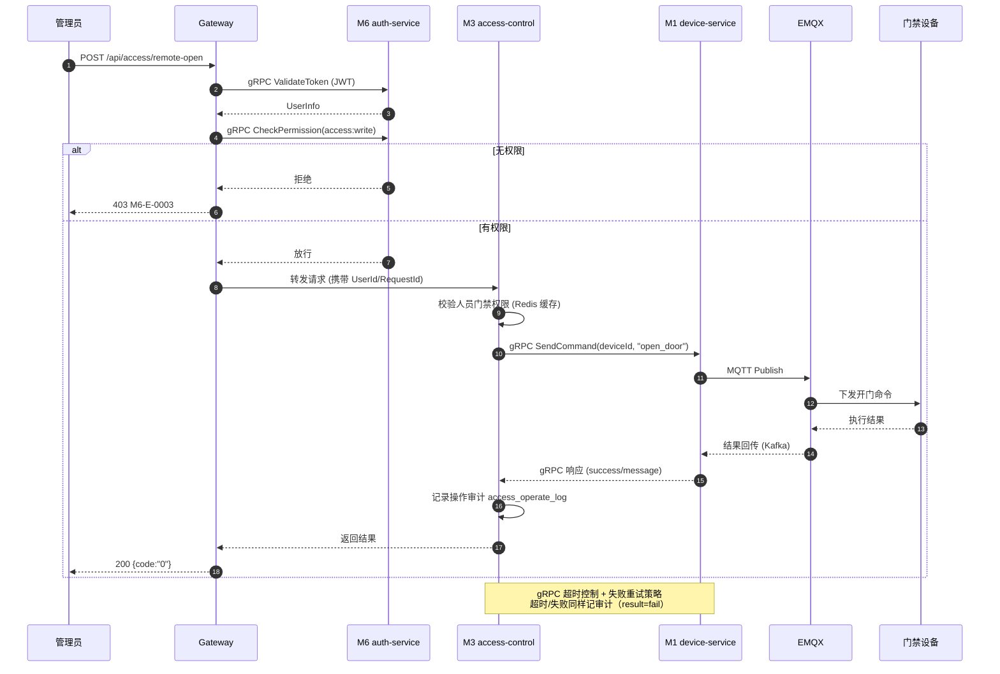
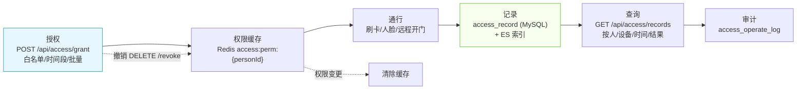
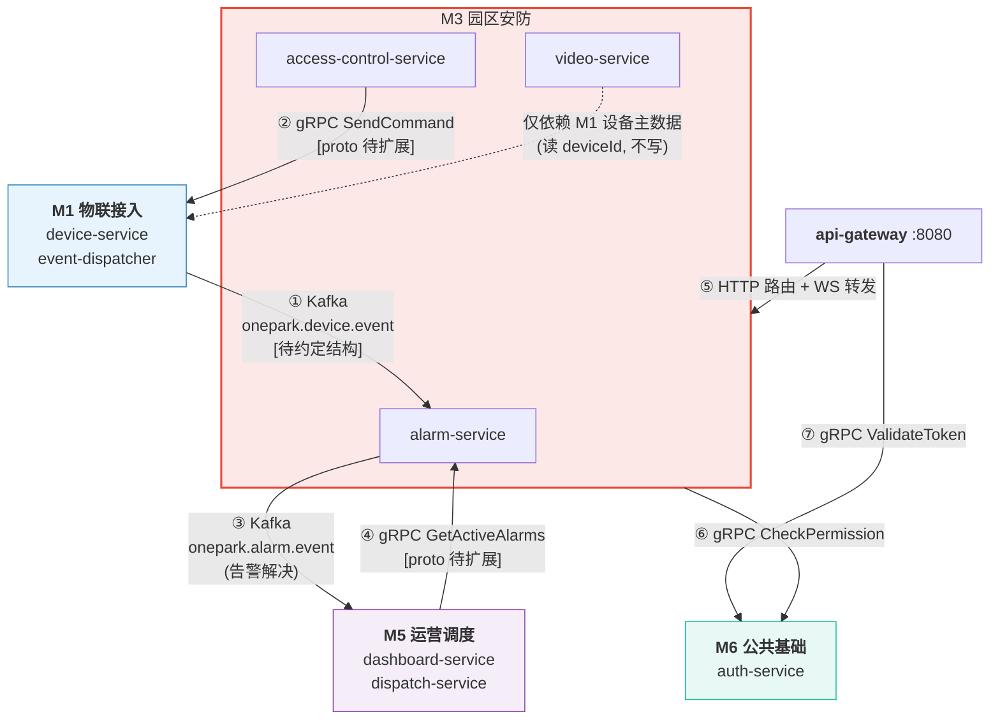
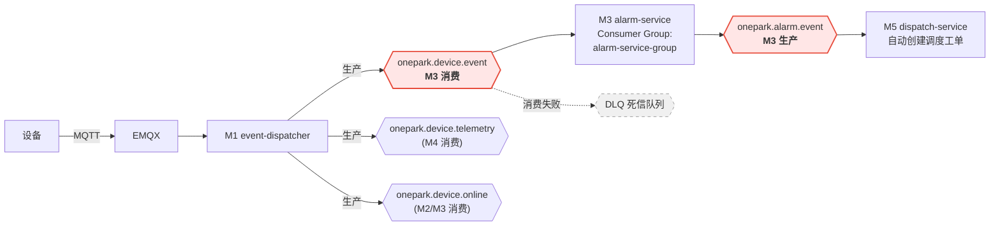

# M3 园区安防服务 — 业务流程图 & 服务依赖关系图

> 配套文档：`01-M3技术方案.md`、`02-M3架构图.md` · 阶段：Day 1 · 状态：待评审

---

## 1. 安防告警核心业务流程（主链路，Day 1 重点交付）

覆盖计划要求的全链路：**设备事件接入 → Kafka → 规则匹配 → Redis 去重 → MySQL 入库 → WS 推送 → 确认/解决 → Kafka 通知 M5**。

**关键技术点对应**：Kafka 消费组 + RequestId 幂等 · 规则引擎 Evaluate（阈值/组合/时间窗口） · Redis `SET NX + TTL` 冷却去重 · GORM 事务写入 · ES 异步双写 · gorilla/websocket 广播 + 心跳 · Kafka 跨模块通知 M5

---

## 2. 告警状态机

> **待确认 P1-2**：是否允许「未处理 → 已解决」直接跳转（跳过确认）。当前设计允许，如需强制经「已确认」，需在 Day 10 加状态转移校验。

---

## 3. 门禁远程开门链路（Day 17）

---

## 4. 门禁业务闭环（授权 → 通行 → 记录 → 查询）

---

## 5. 服务依赖关系图

### 依赖交互明细表

| 序号 | 方向 | 对端服务 | 协议/通道 | 内容 | 契约状态 |
|------|------|---------|----------|------|---------|
| ① | M1 → M3 | event-dispatcher → alarm-service | Kafka `onepark.device.event` | 设备安防事件（门禁异常/人员检测/传感器越限） | ⚠️ **P0-2 消息结构待约定** |
| ② | M3 → M1 | access-control → device-service | gRPC `SendCommand` | 远程开门命令 | ⚠️ **P0-3 proto 待扩展** |
| ③ | M3 → M5 | alarm-service → dispatch-service | Kafka `onepark.alarm.event` | 告警解决事件 → 自动调度工单 | ⚠️ 消费语义待与 M5 对齐 |
| ④ | M5 → M3 | dashboard-service → alarm-service | gRPC `GetActiveAlarms` | 大屏聚合查活跃告警数 | ⚠️ **P0-3 proto 待扩展** |
| ⑤ | 网关 → M3 | api-gateway → 三服务 | HTTP + WS | 路由转发（`/api/alarm/*` `/api/access/*` `/api/video/*` `/ws/alarm`） | ⚠️ **P0-4 网关为空壳，待实现** |
| ⑥ | M3 → M6 | 三服务 → auth-service | gRPC `CheckPermission` | RBAC 权限校验 | ⚠️ 依赖 M6 提供 |
| ⑦ | 网关 → M6 | api-gateway → auth-service | gRPC `ValidateToken` | JWT 校验 + UserId 注入 | ⚠️ 依赖 M6/网关 |

**明确无依赖**：M3 与 M2（物业/访客）无直接调用——访客开门由 M2 自行调 M1；M3 与 M4（能源）无交互。

---

## 6. Kafka Topic 数据流图

### Topic 责任矩阵

| Topic | 生产方 | 消费方 | M3 角色 | 消息结构 |
|-------|--------|--------|---------|---------|
| `onepark.device.event` | M1 event-dispatcher | **M3 alarm-service**（+ 其他模块） | 消费 | ⚠️ 待约定（见文档 04 §3.1） |
| `onepark.alarm.event` | **M3 alarm-service** | M5 dispatch-service | 生产 | `common.AlarmEvent`（已预置） |
| `onepark.device.online` | M1 event-dispatcher | M2 / M3 | 消费（更新状态） | 待约定 |

---

## 7. Day 1 流程设计自检

| 验收项 | 覆盖情况 |
|--------|---------|
| 核心链路 8 环节全覆盖 | ✅ §1 时序图（设备→M1→Kafka→规则→去重→MySQL→WS→M5） |
| 告警状态机明确 | ✅ §2（含 P1-2 待确认点） |
| 门禁链路（授权/开门/记录） | ✅ §3、§4 |
| 与 M1/M5/M6 依赖闭合 | ✅ §5（7 条交互全部列出，含契约状态） |
| Kafka Topic 责任清晰 | ✅ §6 |
| ES / Redis 在流程中的位置 | ✅ §1（ES 异步双写、Redis 冷却去重 + 计数缓存） |
