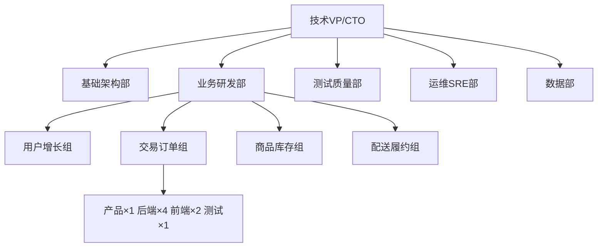
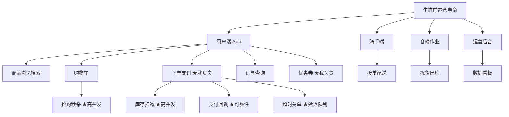

# 行业数据基准与推算手册

第二步、第三步的执行依据。所有产出数字从本手册推算，禁止拍脑袋。

## 一、项目类型量级基准（对标市面大型同类项目）

| 项目类型 | 代表公司 | DAU 量级 | 日订单/单量 | 流量特征 |
|---|---|---|---|---|
| 外卖 | 美团外卖、饿了么 | 数千万 | 日单数千万 | 午晚双高峰，峰值系数 4-5 |
| 生鲜电商 | 叮咚买菜、朴朴、盒马 | 数百万 | 日单数百万 | 早高峰+大促，峰值系数 4-6 |
| 打车/网约车 | 滴滴、花小猪、T3 | 数百万-数千万 | 日订单数千万 | 早晚上下班高峰，派单实时性要求高 |
| 快递物流 | 顺丰、菜鸟、中通 | 数十万-数百万（B 端+C 端） | 日包裹数千万 | 白天作业型，批量吞吐要求高 |
| 通用电商 | 淘宝、京东、拼多多 | 亿级 | 大促日订单亿级 | 大促瞬时洪峰，秒杀场景 |

**公司档位 → 数据档位：**

| 档位 | 研发规模 | DAU | 峰值 QPS | 适用框架 |
|---|---|---|---|---|
| 一线大厂 | 2000+ | 1000 万+ | 1 万-10 万+ | 自研 + go-zero/kratos 混合 |
| 独角兽 | 500-2000 | 100 万-1000 万 | 5000-2 万 | kratos / go-zero |
| 成长期中厂 | 100-500 | 10 万-100 万 | 500-5000 | go-zero / kratos / gin 自研 |

## 二、核心数据推算公式（必背，面试被问"怎么来的"就靠它）

1. **日请求量** = DAU × 人均核心请求数
   - 外卖/生鲜：人均 20-40 次（浏览+下单+查单）
   - 打车：人均 10-20 次（叫车+刷新+支付）
   - 电商：人均 50+ 次（大量浏览）
2. **平均 QPS** = 日请求量 ÷ 86400
3. **峰值 QPS** = 平均 QPS × 峰值系数（3-5；大促 ×2-3 活动系数）
4. **核心链路 TPS** ≈ 峰值 QPS × 10%-20%（大部分流量是浏览，下单只占一小部分）
5. **订单表规模** = 日订单 × 365 × 年增长系数（1.5-2）
6. **经验参照**：1 万 QPS ≈ 每天 8.6 亿次请求；单机 Go 服务（16C32G）简单接口约 3000-8000 QPS，复杂业务接口 500-2000 QPS

**推算示例（生鲜电商 · 独角兽档）：**
- DAU 300 万 × 人均 25 次 = 日请求 7500 万
- 平均 QPS ≈ 870
- 峰值 QPS ≈ 870 × 4.5 ≈ 3900（早高峰抢菜）
- 下单 TPS ≈ 3900 × 15% ≈ 600
- 订单表 ≈ 日单 40 万 × 365 ≈ 1.5 亿行/年 → 需分库分表

## 三、研发组织架构模板（Mermaid，按档位缩放）

- 大厂：加"中间件组、安全部、基础平台"；
- 中厂：合并为"技术部 → 业务组"，一组 8-12 人；
- 学生定位写法：**后端研发工程师 · 交易订单组**，负责订单服务/支付回调/超时关单，与产品 1 人、前端 2 人、测试 1 人日常协作。

## 四、服务器规格基准（与数据档位匹配）

| 组件 | 独角兽档（DAU 百万级） | 大厂档（DAU 千万级） |
|---|---|---|
| 网关/接入 | 8C16G × 4 台 | 16C32G × 8-16 台 + SLB |
| Go 业务服务 | 16C32G × 每服务 4-8 副本（容器化） | 容器集群按流量弹性，每服务 10+ 副本 |
| MySQL | 16C64G SSD 一主两从 × 按业务域拆分 | 分库分表，每片 8C32G 一主三从 |
| Redis | 集群模式 16C64G × 6 节点 | 多集群，百 G 内存级 |
| Kafka | 16C64G × 3-5 broker | 跨机房集群 |
| etcd | 8C16G × 3 节点 | 5 节点跨机房 |
| 监控日志 | Prometheus + Grafana + ELK 独立 3-5 台 | 全套独立部门维护 |

## 五、技术选型对比（架构段必备，面试常问）

1. **框架**：
   - go-zero：内置服务治理、代码生成效率高，适合业务快速迭代的中厂；
   - kratos：B 站开源，分层清晰（biz/data/service），适合长期维护的大中型项目；
   - 自研：大厂基于内部中间件沉淀，统一公司标准。
   - 讲法：结合"团队熟悉度 + 招人容易度 + 迭代速度"三选一。
2. **为什么 Go**：goroutine 并发模型适合 IO 密集网关业务；编译型部署简单；云原生生态（K8s/Docker）成熟。
3. **存储**：MySQL 先撑量，超过单表 500 万行/写瓶颈再分库分表；Redis 集群模式扩容方便；Kafka 高吞吐适合削峰与事件驱动。
4. **服务拆分**：按业务域（用户/商品/订单/支付/履约），API 网关 + RPC 服务两层，etcd 注册发现。

## 六、项目功能结构图模板（Mermaid）

- ★ 标注"我负责"与"高并发热点"；
- 功能树至少两级，亮点候选从 ★ 里挑。

## 七、表述口径建议

1. 面试说"我在一家做 XX 业务的公司"或"一个对标美团的项目"，比直接报真实大厂在职更稳（避免背调穿帮）；
2. 数字记**推算公式**而不是死记结果——被追问"怎么来的"时现场算，反而加分；
3. 全套材料口径一致：公司名、DAU、QPS、机器数、框架，在简历、讲解稿、追问答案里必须完全相同；
4. 简历上写"核心业务研发工程师（订单/交易方向）"，亮点写 1-2 个就够，不贪多。
